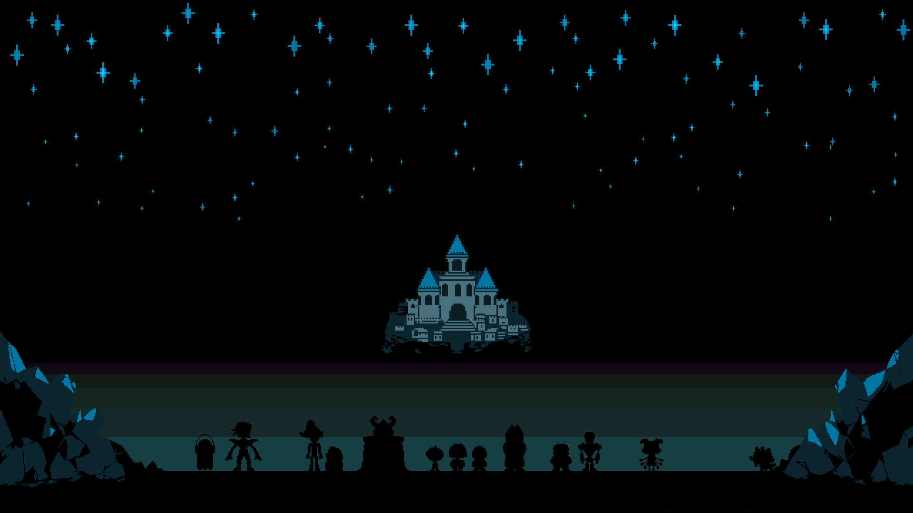

# 自己紹介

ここでは私の自己紹介について書かれています。

## アカウント情報

アカウント名: ittokunvim

名前: ittoku（いっとく）

パスワード: 秘密🤫

## アイコン画像

アイコン画像1

アイコン画像2

ヘッダー画像

## 自己紹介文

### 短いバージョン

はじめまして、Ittoku（いっとく）です！
趣味はプログラミングで、最近はRust製ゲームエンジン「Bevy」を使ったゲーム開発にハマっています。
よろしくお願いします！

### 長いバージョン

はじめまして、Ittoku（いっとく）です！
趣味はプログラミングで、最近はRust製ゲームエンジン「Bevy」を使ったゲーム開発にハマっています。
普段はコツコツ個人開発をしていて、技術を試しながら小さなプロジェクトを作るのが好きです。
このアカウントでは学んだことや制作中のものをシェアしていく予定なので、
興味のある方はぜひ仲良くしてください！
よろしくお願いします！

### ウェブサイトバージョン

はじめまして、Ittoku（いっとく）です！
趣味はプログラミングで、最近はRustという言語で作られたゲームエンジン
「Bevy」を使ったゲーム開発にハマっています。
普段は、個人でコツコツと開発を進めており、技術を試しながら小さなプロジェクトを作るのが好きです。
このサイトでは、学んだことや制作中の作品などをシェアしていく予定ですので、
もしご興味があればぜひお気軽に覗いていってください。
今後とも、どうぞよろしくお願いします！

