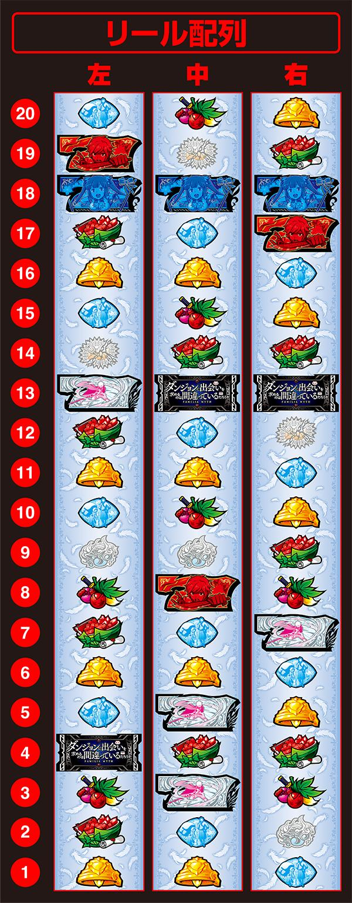
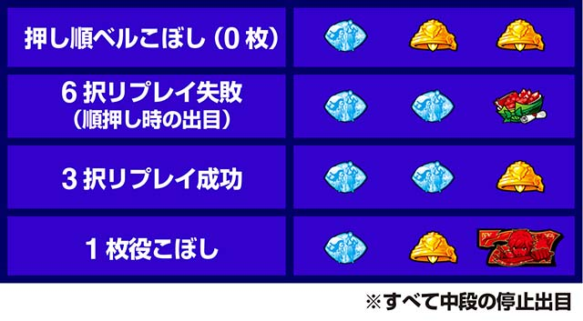
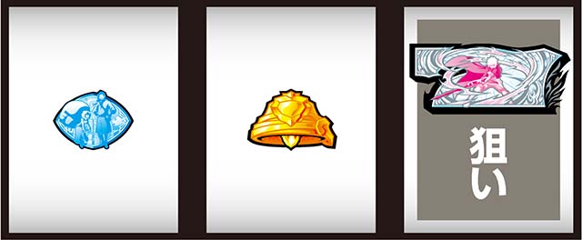
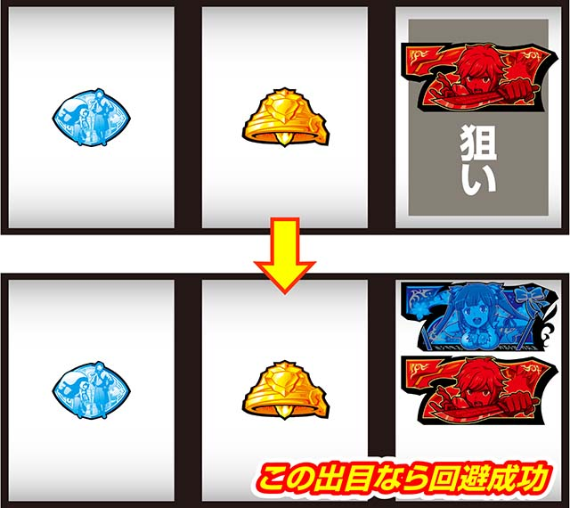

# ダンまち2 | 1枚役について

ここでは「パチスロ ダンジョンに出会いを求めるのは間違っているだろうか2」の1枚役について解説しています。

## リール配列

## 1枚役

ダンまち2では1枚役を入賞・回避することでベースが上がり、機械割がアップさせることができる。

なぜベースが上がるのかというと、本機には5つのRT状態があり、状態によって1枚役を打ち分けることで良いRT状態を維持させてベースを上げるということ。

またART中は1枚役を入賞、ART準備中は1度だけ回避し、その後は入賞させる。

## RT遷移図

上の図で言うと「RT2」の状態を長く保つことでベースが上がる。

## RT状態ごとの打ち分けと遷移

**RT0（通常時）**

| 出目     | 結果       |
| -------- | ---------- |
| 1枚役    | 入賞する   |
| リベべ   | RT1に遷移  |
| リリス   | RT3に遷移  |
| リリベ   | 出現しない |

**RT1（通常時・ART準備）**

| 出目     | 結果            |
| -------- | --------------- |
| 1枚役    | 回避しRT2に遷移 |
| リベべ   | 特になし        |
| リリス   | RT3に遷移       |
| リリベ   | RT2に遷移       |

**RT2（通常時・CZ・ART準備・ART）** 

| 出目     | 結果       |
| -------- | ---------- |
| 1枚役    | 入賞する   |
| リベべ   | RT1に遷移  |
| リリス   | 特になし   |
| リリベ   | 特になし   |

**RT3（通常時）**

| 出目     | 結果       |
| -------- | ---------- |
| 1枚役    | 入賞する   |
| リベべ   | 特になし   |
| リリス   | 特になし   |
| リリベ   | 特になし   |

`RT3`中は38G消化すると`RT0`に遷移する。

液晶でヘスティアが「伸び」のアクションをとれば38G消化の合図。`RT0`に遷移する

**RT4（通常時・ART準備）**

| 出目     | 結果            |
| -------- | --------------- |
| 1枚役    | 回避しRT2に遷移 |
| リベべ   | RT1に遷移       |
| リリス   | 出現しない      |
| リリベ   | 出現しない      |

`RT4`はボーナス終了後に遷移する。

## 1枚役の停止型

1枚役は中段に「リプレイ・ベル・白7 or BAR or ブランク図柄」が揃う形。

1枚役こぼし目は中段に「リプレイ・ベル・赤7」が揃う形となる。

**1枚役入賞**

左・中リールは適当で、右リールに白7を狙うことで問題なく1枚役を入賞させることができる。

**1枚役回避**

右リール下段に13~16番を目押しすることで1枚役を回避することができる。

**中段リリベ**

中段リリベが揃うと`RT2`滞在が濃厚、中段リベべが揃うまで1枚役をフォローしよう。

## まとめ

いかがだったでしょうか。

RT状態は正直に言うとすごくややこしいです。知らないユーザーからすると何が起きているのか分からずプレイしていて不安に思うこともあるかと思われます。

しかしRT状態を理解することによって機械割を上げるだけでなく、ダンまち2をより楽しく打てるようになるのではないかと思いました。

見ていただきありがとうございました！

## 参考URL

https://p-town.dmm.com/machines/4556#anc-title-72892

## 公式サイト

https://kitac-danmachi2.jp/
