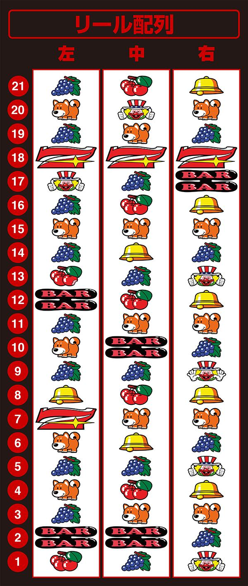

# ファンキージャグラー２ | 設定判別

2021年10月4日に登場したファンキージャグラー2。

ド派手なジャグラーです🤡

## リール配列

## ボーナス確率

| 設定 | BIG確率 | REG確率 | ボーナス合算 |
| ---- | ------- | ------- | ------------ |
| 1    | 1/266.4 | 1/439.8 | 1/165.9      |
| 2    | 1/259.0 | 1/407.1 | 1/158.3      |
| 3    | 1/256.0 | 1/366.1 | 1/150.7      |
| 4    | 1/249.2 | 1/322.8 | 1/140.6      |
| 5    | 1/240.1 | 1/299.3 | 1/133.2      |
| 6    | 1/219.9 | 1/262.1 | 1/119.6      |

設定`6`のBIG確率がヤバい😬

## 機械割

| 設定 | 機械割1 | 機械割2 | 機械割3 |
| ---- | ------- | ------- | ------- |
| 1    | 97.00%  | 97.83%  | 98.57%  |
| 2    | 98.50%  | 99.36%  | 100.08% |
| 3    | 99.80%  | 100.99% | 101.72% |
| 4    | 102.00% | 103.40% | 104.14% |
| 5    | 104.30% | 106.04% | 106.78% |
| 6    | 109.00% | 111.35% | 112.08% |

機械割1: メーカー発表値

機械割2: チェリー狙い

機械割3: フル攻略（チェリー・ピエロ・ベル狙い・ブドウ抜き）

ファンキーの機械割は高いが、下は低い

## 子役確率

| 設定 | ブドウ | チェリー |
| ---- | ------ | -------- |
| 1    | 1/5.94 | 1/35.62  |
| 2    | 1/5.92 | 1/35.62  |
| 3    | 1/5.88 | 1/35.62  |
| 4    | 1/5.83 | 1/35.62  |
| 5    | 1/5.76 | 1/35.62  |
| 6    | 1/5.67 | 1/35.62  |

ピエロ・ベル確率：1/1092.27

チェリー確率に設定差はなし。

## BIG確率

| 設定 | 単独BIG  | チェリーBIG | レアチェリー |
| ---- | -------- | ----------- | ------------ |
| 1    | 1/404.54 | 1/1424.70   | 1/1724.63    |
| 2    | 1/397.19 | 1/1365.33   | 1/1638.40    |
| 3    | 1/394.80 | 1/1365.33   | 1/1560.38    |
| 4    | 1/383.25 | 1/1365.33   | 1/1489.45    |
| 5    | 1/374.49 | 1/1285.02   | 1/1394.38    |
| 6    | 1/334.37 | 1/1260.31   | 1/1310.72    |

レアチェリーは全設定で`1/90`ぐらいで変わってくる

単独BIGは5と6では大違い‼️

## REG確率

| 設定 | 単独REG  | チェリーREG |
| ---- | -------- | ----------- |
| 1    | 1/630.15 | 1/1456.36   |
| 2    | 1/585.14 | 1/1337.47   |
| 3    | 1/512.00 | 1/1285.02   |
| 4    | 1/448.88 | 1/1149.75   |
| 5    | 1/404.54 | 1/1149.75   |
| 6    | 1/352.34 | 1/1024.00   |

単独REGは全設定で`1/50`ぐらい変わってくる

## レアチェリー確率

| 設定 | レアA     | レアB     | レアABP     |
| ---- | --------- | --------- | ----------- |
| 1    | 1/6553.60 | 1/6553.60 | 1/16384.00  |
| 2    | 1/5957.82 | 1/5957.82 | 1/16384.00  |
| 3    | 1/5461.33 | 1/5461.33 | 1/16384.00  |
| 4    | 1/5041.23 | 1/5041.23 | 1/16384.00  |
| 5    | 1/4681.14 | 1/4681.14 | 1/10922.70  |
| 6    | 1/4369.14 | 1/4369.14 | 1/10922.70  |

レアA: BAR上チェリー

レアB: BAR下チェリー

レアABP: ピエロ7ピエロ(中段チェリー)

中段チェリー出現で高設定の可能性が‼️

## 設定判別

分母は大きいが、REG確率に設定差アリ‼️

特に単独REG確率を要チェック‼️

レアチェリーにも設定差アリ‼️

ブドウも一応数えておくといいかも。

ファンキーは確率での設定判別が難しい機種。確率より設定が入る根拠の方が大事な機種かもしれない。

## 公式サイト

https://www.kitadenshi.co.jp/products/2021/fjg2/

## 機種解析サイト

https://jug123.com/funky2spec/

## リール画像

https://p-town.dmm.com/machines/3961
