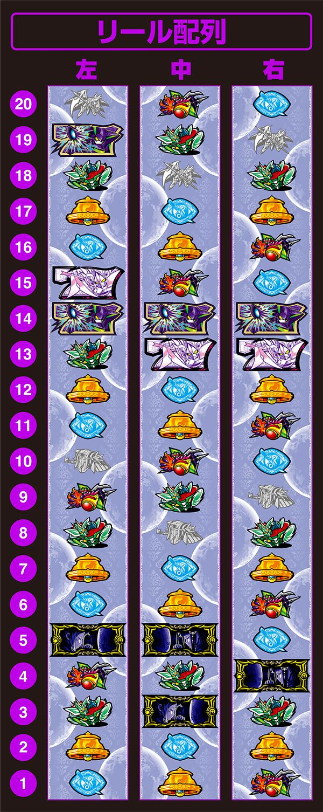

# 回胴式遊技機グランベルム | 通常時解析

ここでは「回胴式遊技機グランベルム」の通常時の解析について書かれています。

## リール画像

画像は「[DMM ぱちタウン](https://p-town.dmm.com/machines/4406)」様からお借りしております。

## 子役確率

| 子役       | 確率    |
| ---------- | ------- |
| スイカ     | 1/71.3  |
| 弱チェリー | 1/100.8 |
| チャンス目 | 1/133.5 |
| 強チェリー | 1/378.8 |
| トータル   | 1/29.3  |

### 払い出し枚数

| 子役       | 枚数 |
| ---------- | ---- |
| 魔力目     | 1枚  |
| 共通ベル   | 3枚  |
| チャンス目 | 3枚  |
| 弱チェリー | 5枚  |
| 強チェリー | 5枚  |
| スイカ     | 6枚  |
| 押し順ベル | 12枚 |

## 通常モード

モードは高設定ほどCが選ばれる。

| ゲーム数  | モードA | モードB | モードC | モードD | 
| --------- | ------- | ------- | ------- | ------- |
| 1G~98G    | -       | -       | ▲       | ⚪︎      |
| 99G~148G  | ▲       | ○       | -       | 天井    |
| 149G~198G | -       | ▲       | ▲       |         |
| 199G~248G | ◎       | ▲       | 天井    |         |
| 249G~298G | ▲       | -       |         |         |
| 299G~348G | ▲       | ◎       |         |         |
| 349G~398G | -       | 天井    |         |         |
| 399G~448G | ◎       |         |         |         |
| 449G~498G | ▲       |         |         |         |
| 499G~548G | ▲       |         |         |         |
| 549G~598G | ▲       |         |         |         |
| 599G~648G | ○       |         |         |         |
| 649G~698G | 天井    |         |         |         |

### モード推測

| ゲーム数 | 演出   | 示唆            |
| -------- | ------ | --------------- |
| ~98G     | 非発生 | モードC以上示唆 |
| 99~148G  | 非発生 | モードB以上示唆 |
| 149~198G | 発生   | モードC以上示唆 |
| 199~248G | 非発生 | モードB示唆     |

### ボーナス昇格抽選

| CZモード | レア魔力目 | 弱チェ | スイカ | チャンス目 | 強チェ |
| -------- | ---------- | ------ | ------ | ---------- | ------ |
| 1        | -          | 1.2%   | -      | 16.0%      | 28.5%  |
| 2        | -          | 1.2%   | -      | 20.3%      | 38.3%  |
| 3        | -          | 2.4%   | 25.0%  | 24.2%      | 50.0%  |
| 4        | 7.8%       | 3.2%   | 38.7%  | 33.2%      | 75.0%  |

## CZモード、抽選、示唆

CZモードは`1~4`まであり、CZ当選まで転落しない仕組み。

体感、CZモード3からCZに期待できる。強チェリーはどのモードでもチャンス。

### 初期CZモード

| CZモード | 振り分け |
| -------- | -------- |
| モード1  | 76.4%    |
| モード2  | 13.6%    |
| モード3  | 8.8%     |
| モード4  | 1.2%     |

### CZモード昇格抽選

設定判別の項目からチェック。

### CZ当選率

CZ当選は主に「サモンズチャレンジ」が選ばれる。
稀に弱チェリーの薄い確率で「黄昏の聖域」に当選したり、
サモンズチャレンジ前兆中のチャンス役の昇格で「マギアコナトスチャレンジ」に当選することもある。

#### サモンズチャレンジ

| CZモード | レア魔力目 | スイカ | チャンス目 | 強チェ |
| -------- | ---------- | ------ | ---------- | ------ |
| モード1  | -          | -      | 16.4%      | 30.1%  |
| モード2  | -          | -      | 20.3%      | 40.2%  |
| モード3  | -          | 25.0%  | 24.2%      | 50.0%  |
| モード4  | 7.8%       | 38.7%  | 33.2%      | 75.0%  |

#### 黄昏の聖域

| CZモード | 弱チェ |
| -------- | ------ |
| モード1  | 1.2%   |
| モード2  | 1.2%   |
| モード3  | 2.4%   |
| モード4  | 3.2%   |

#### マギアコナトスチャレンジ

| 成立役             | 昇格率 |
| ------------------ | ------ |
| レア魔力目、スイカ | 0.4%   |
| 弱チェリー         | 2.0%   |
| チャンス目         | 5.1%   |
| 強チェリー         | 25.0%  |

### CZモード示唆

CZモード示唆は覚えるのが大変なくらいあるけど、知っておくと役に立つ。

#### ステージ

| ステージ   | 示唆          |
| ---------- | ------------- |
| 満月の家   | 示唆ナシ      |
| 通学路     | デフォルト    |
| 湖周辺     | CZモード2以上 |
| コンビニ   | CZモード3以上 |
| アンナの家 | CZモード4濃厚 |

#### 前兆発生

| チャンス役 | CZモード1 | CZモード2 | CZモード3 | CZモード4 | 
| ---------- | --------- | --------- | --------- | --------- |
| 強チェリー | ◎         | ◎         | ◎         | ◎         | 
| チャンス目 | ▲         | ○         | ◎         | ◎         |
| スイカ     | -         | ▲         | ○         | ◎         |
| レア魔力目 | -         | -         | ▲         | ◎         |

#### サイドランプ

チャンス役入賞+CZ昇格の`20.0%`でサイドランプ点滅。

#### バックライト

フラッシュAは光が下から上に流れる。
フラッシュBは光が下から上に流れた後、フラッシュする。

| フラッシュ | CZモード1 | CZモード2 | CZモード3 | CZモード4 | 
| ---------- | --------- | --------- | --------- | --------- |
| リプ+A     | ▲         | ▲         | ○         | ○         | 
| リプ+B     | -         | ▲         | ▲         | ○         |
| ベル+A     | -         | -         | ▲         | ○         |
| ベル+B     | -         | -         | -         | ◎         |

#### 会話演出

| 会話キャラ         | CZモード1 | CZモード2 | CZモード3 | CZモード4 |
| ------------------ | --------- | --------- | --------- | --------- |
| 満月、九音、新月   | ▲         | ◯         | ◯         | ◯         |
| ロサ、水晶、アンナ | ▲         | △         | ◯         | ◯         |
| 寧々               | −         | △         | △         | ◯         |
| 希望、クレア       | −         | −         | ▲         | ◎         |

#### 花びら

花びら演出は早く目押ししすぎると、演出を見逃すので注意。

| パターン    | CZモード1 | CZモード2 | CZモード3 | CZモード4 |
| ----------- | --------- | --------- | --------- | --------- |
| 1st・左から | -         | -         | -         | -         |
| 1st・右から | −         | ▲         | △         | ◎         |
| 3rd・左から | ▲         | △         | ◯         | ◎         |
| 3rd・右から | −         | −         | ▲         | △         |

#### サンド目を狙え

BARサンド目を狙えフェイク演出発生でCZモード2以上が濃厚で、さらに上のモードも期待ができる。

#### 寧々CZ連続演出失敗

寧々CZ連続演出に失敗したらCZモード4かも。

## ブラッドムーン

ブラッドムーン状態に移行すると通常時の様々な抽選が優遇される状態。

ブラッドムーンは滞在を確認できたら、打ったほうが良いが、
設定に期待を持てない場合は捨てるのも視野に入れたほうが良いと個人的には思う。

### 優遇項目

ブラッドムーン状態時は5つの中2つ以上が発動し、5つ全て発動することもある。

- 通常モードの振り分け優遇
- 初期CZモード振り分け優遇
- CZモード昇格率優遇
- ミッドナイトボーナス2ndステージ開始、エピボ振り分け優遇
- AT直撃確率優遇

#### 通常モード振り分け

モードABCDの振り分けが均等になる(25%)。

#### 初期CZモード振り分け

| CZモード  | 振り分け |
| --------- | -------- |
| CZモード1	| −        |
| CZモード2	| 76.4%    |
| CZモード3	| 13.6%    |
| CZモード4	| 10.0%    |

#### CZモード昇格率

チャンス役成立時にCZモード昇格抽選に外れた`1/2`で再抽選する。

#### ボーナスのステージ優遇

| ステージ    | 振り分け |
| ----------- | -------- |
| 1stステージ | 37.5%    |
| 2ndステージ | 37.5%    |
| エピボ      | 25.0%    |

#### AT直撃抽選優遇

AT直撃確率が`1/1500`に上昇する。

### 突入契機

プレイヤーにとってよくないことが起きるほど移行抽選が優遇される。

またボーナス、AT終了時にブラッドムーンの継続抽選が行われる。

| 契機                      | 突入期待度 |
| ------------------------- | ---------- |
| 800枚未満の獲得でAT終了時 | ▲          |
| サモンズチャレンジ失敗時  | ▲          |
| ボーナスからAT非当選時    | △          |
| ボーナス間399G以上消化    | △          |
| ボーナス間599G以上消化    | ◯          |
| リセット・設定変更時      | ◯          |

### ブラッドムーン示唆

ブラッドムーンの示唆は出た時点で期待度が高いので見逃さないようにしよう。

#### 月が赤色に変化

筐体右上の月が赤く光るとブラッドムーン状態濃厚。

| モード         | 点灯しやすさ |
| -------------- | ------------ |
| ベーシック     | ◎            |
| ナカミミエール | ◯            |
| アタリミエール | △            |

#### 招アイテム

アタリミエールモードで「招」アイテム出現でブラッドムーン状態濃厚。

#### 希望とクレア

下記の希望・クレアの会話が出てきたらブラッドムーンに期待。

| キャラ  | セリフ     | 期待度 |
| ------- | ---------- | ------ |
| 希望1   | チャーハン | 約38%  |
| 希望2   | 小籠包     | 約71%  |
| クレア1 | クッキー   | 約38%  |
| クレア2 | お紅茶     | 約71%  |

#### 花びら演出

左からの花びら演出ロングはブラッドムーン期待度72%。

#### その他

ゲーム数前兆で期待度星4失敗した時の期待度は67%。

ゲーム数前兆で赤帯外しで65%。

## サモンズチャレンジ

成功でボーナスに当選するCZ。
ゲーム数は`5G/10G/無限`で、全役で抽選を行っている。
成功期待度は約`38%`。

### ゲーム数振り分け

| G数  | 振り分け |
| ---- | -------- |
| 5G   | 87.6%    |
| 10G  | 12.0%    |
| 無限 | 0.4%     |

### 抽選

1Gあたりの成功確率は`1/12.2`。

| 成立役                          | 期待度 |
| ------------------------------- | ------ |
| リプレイ、ベル                  | 0.4%   |
| 魔力目                          | 16.8%  |
| 弱チェリー、スイカ              | 50.0%  |
| チャンス目、強チェリー、BAR揃い | 100%   |

また1G目のベルの`0.6%`でヘブンズアタック。

極楽目チャレンジは発生率`1/399.6`、成功期待度`1/2`。
成功でヘブンズアタック、失敗でミッドナイトボーナス以上となる。

## 黄昏の聖域

成功でATに当選するCZ。
ゲーム数`10G+a`で、消化中は子役以上で抽選を行なっている。
成功期待度は約`33%`。

| 成立役         | 期待度 |
| -------------- | ------ |
| リプレイ、ベル | 0.4%   |
| 魔力目         | 5.1%   |
| 弱チェ、スイカ | 25.0%  |
| チャンス目     | 66.8%  |
| 強チェ         | 100%   |

## マギアコナトスチャレンジ

突入時点でミッドナイトボーナス以上濃厚のCZ。
ゲーム数は`10G`で、消化中は全役でエピボの抽選を行う。
成功でエピソードボーナス、失敗でもミッドナイトボーナス以上となる。

### 抽選

| 成立役              | 期待度 |
| ------------------- | ------ |
| リプレイ、ベル      | 0.4%   |
| 魔力目              | 33.2%  |
| チャンス役、BAR揃い | 100%   |

そのほかにも`1G`目ベルのヘブンズアタック抽選、`1/399.6`の極楽目チャレンジの抽選も行っている。

## 陰陽五行

成功でATに当選するCZ。
ST式のCZで、`5pt`貯めることでATに当選する。
5G間に魔力目以上の役を引けなかった場合、CZ失敗となる。

### 抽選

| ポイント | 魔力目 | スイカ | 弱チェ | チャンス目 | 強チェ、BAR揃い |
| -------- | ------ | ------ | ------ | ---------- | --------------- |
| 1pt      | 97.6%  | 75.0%  | 50.0%  | -          | -               |
| 2pt      | 2.4%   | -      | 49.6%  | 47.3%      | -               |
| 3pt      | -      | 24.6%  | -      | 47.3%      | -               |
| MAX      | -      | 0.4%   | 0.4%   | 5.4%       | 100%            |

リプレイはSTゲーム数が減算されない。

## 北の湯

AT引き戻し前兆のステージ。
ガセ前兆の場合は成立役に応じて本前兆の書き換え抽選を行う。

ステージが北の湯でも、内部的に「陰陽五行」の抽選を行なっている可能性もあり、
「陰陽五行」非当選だった場合は「北の湯テーブル」でATの抽選を行なっている。

### 北の湯テーブル

北の湯テーブルは毎ゲーム`93.3%`で継続。
リプレイ、魔力目、チャンス役は継続濃厚。

| 成立役         | 期待度 |
| -------------- | ------ |
| 魔力目         | 0.4%   |
| 弱チェ、スイカ | 3.1%   |
| チャンス目     | 12.5%  |
| 強チェ         | 50.0%  |

## アタリミエールモード

次回規定G数でのボーナスの期待度や残りG数を察知できるモード。

**アイテム**

| アイテム | 示唆                   |
| -------- | ---------------------- |
| 怪（青） | 示唆なし               |
| 怪（緑） | 199G以内、チャンス     |
| 怪（赤） | 199G以内、大チャンス   |
| 願（緑） | 299G以内、ほぼ濃厚     |
| 願（赤） | 199G以内、ほぼ濃厚     |
| 招       | ブラッドムーン状態濃厚 |

体感的には信用できるのが「怪（赤）」以上。

**味方レベル**

現味方レベルは液晶の右下で確認できる。

**UI色**

| 色 | 示唆                     |
| -- | ------------------------ |
| 青 | 満月以上の連続演出に発展 |
| 緑 | 九音以上の連続演出に発展 |
| 赤 | 新月以上の連続演出に発展 |
| 紫 | 寧々の連続演出に発展     |

**UI数値**

| 数値 | 示唆                            |
| ---- | ------------------------------- |
| 1    | 対決レベル1以上の連続演出に発展 |
| 2    | 対決レベル2以上の連続演出に発展 |
| 3    | 対決レベル3以上の連続演出に発展 |
| 4    | 対決レベル4の連続演出に発展     |

## ナカミミエールモード

設定推測が行えるモード。

詳しい数値については[こちら](https://chonborista.com/slot/kitadenshi/190519/)。

重視する点は、希の緑と確定系。

## まとめ

グランベルムの通常時は様々な推測ができて、打ってて飽きないようになっています。

規定ゲーム数やチャンスゾーンの演出バランスも非常に良く、
退屈な通常時もそこそこ楽しく打てるようになっているのがよく作り込まれているなと思う。

## 参考サイト

本家サイト

https://kitac-granbelm.jp/

リール画像

https://p-town.dmm.com/machines/4406

解析情報

https://chonborista.com/slot/kitadenshi/190519/
