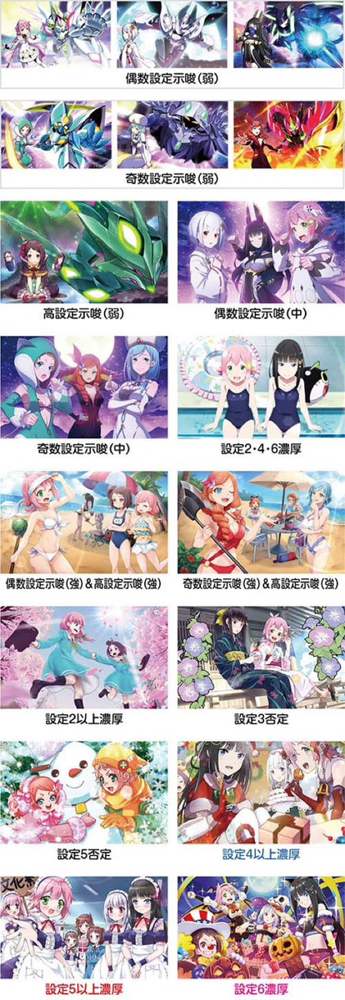
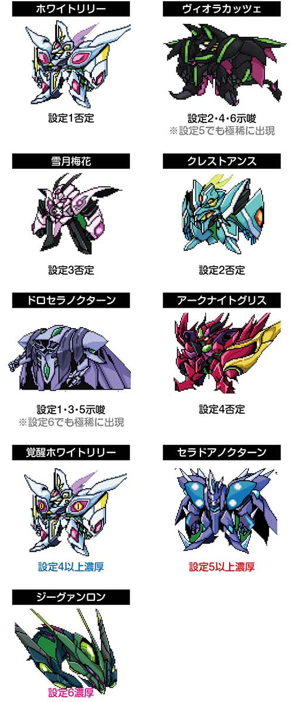

# 回胴式遊技機グランベルム | 解析、設定

ここではグランベルムの機種解析と設定判別などがまとめられています。

「SグランベルムZXZ」は2023/09/04に北電子から導入されたAT機となっています。

個人的にも大好きな台で、2024年11月現在でもコアなファンがいるイメージ。
強いホールとかだと設定入るところもある。最近は台を設置しているお店もだいぶ減ってきた印象。

本家サイトはこちら。

https://kitac-granbelm.jp/

## リール画像

画像は「[DMM ぱちタウン](https://p-town.dmm.com/machines/4406)」様からお借りしております。

## ボーナス確率、機械割

グランベルムの1は辛い!!!

| 設定 | CZ確率   | ボーナス | AT       | 機械割 |
| ---- | -------- | -------- | -------- | ------ |
| 1    | 1/298.7  | 1/287.9  | 1/478.9  | 97.6%  |
| 2    | 1/291.8  | 1/283.1  | 1/466.6  | 98.5%  |
| 3    | 1/278.9  | 1/268.8  | 1/436.0  | 100.7% |
| 4    | 1/258.9  | 1/247.7  | 1/393.8  | 104.5% |
| 5    | 1/245.2  | 1/233.7  | 1/367.5  | 107.6% |
| 6    | 1/235.5  | 1/223.8  | 1/346.1  | 110.9% |

## 設定推測

グランベルムの設定判別は「これだけ見れば設定がわかる」というものはなく、
下記の示唆や挙動を総合的に見て判別を行うのが良い。

### AT終了画面

終了画面は主に設定の奇遇を見抜くのに良い。
エンディング終了画面の示唆は強めなので要チェック。

画像は「[ちょんぼりすた](https://chonborista.com/slot/kitadenshi/190519/)」様からお借りしております。

| 画面                 | 設定1 | 設定2 | 設定3 | 設定4 | 設定5 | 設定6 | 
| -------------------- | ----- | ----- | ----- | ----- | ----- | ----- |
| 満月、九音、新月     | 10.8% | 12.3% | 9.70% | 10.8% | 8.70% | 8.65% |
| ロサ、 水晶、 アンナ | 13.2% | 10.1% | 11.9% | 8.90% | 10.6% | 8.65% |
| 寧々                 | 6.20% | 6.20% | 7.80% | 7.90% | 9.40% | 9.40% |
| 九音＆新月＆満月     | 5.20% | 9.80% | 5.20% | 9.80% | 5.20% | 9.80% |
| ロサ＆アンナ＆水晶   | 8.80% | 5.80% | 8.80% | 5.80% | 8.80% | 5.80% |
| 水着                 | -     | 1.60% | -     | 1.60% | -     | 1.60% |
| ビーチ、味方         | 1.60% | 4.60% | 2.80% | 8.20% | 3.80% | 10.9% |
| ビーチ、敵           | 4.60% | 1.60% | 8.20% | 2.80% | 10.9% | 3.80% |
| 希望＆寧々           | -     | 1.60% | 1.60% | 1.60% | 1.60% | 1.60% |
| 神社                 | 0.80% | 0.80% | -     | 0.80% | 0.80% | 0.80% |
| 雪だるま             | 0.80% | 0.80% | 0.80% | 1.60% | -     | 2.00% | 
| クリスマス           | -     | -     | -     | 0.80% | 0.80% | 0.80% | 
| 文化祭               | -     | -     | -     | -     | 0.80% | 0.80% |
| ハロウィン           | -     | -     | -     | -     | -     | 0.80% |

#### エンディング時の出現割合

| 画面                 | 設定1 | 設定2 | 設定3 | 設定4 | 設定5 | 設定6 | 
| -------------------- | ----- | ----- | ----- | ----- | ----- | ----- |
| 九音＆新月＆満月     | 22.7% | 41.6% | 22.1% | 34.7% | 15.2% | 18.4% |
| ロサ＆アンナ＆水晶   | 45.3% | 20.8% | 44.3% | 17.3% | 30.4% | 18.4% |
| 水着                 | -     | 4.80% | -     | 4.80% | -     | 4.80% |
| ビーチ、味方         | 5.80% | 12.5% | 5.80% | 16.6% | 8.30% | 17.4% |
| ビーチ、敵           | 16.6% | 4.30% | 16.6% | 5.80% | 23.7% | 6.10% |
| 希望＆寧々           | -     | 6.40% | 6.40% | 6.40% | 6.40% | 6.40% |
| 神社                 | 4.80% | 4.80% | -     | 4.80% | 4.80% | 4.80% |
| 雪だるま             | 4.80% | 4.80% | 4.80% | 4.80% | -     | 4.80% | 
| クリスマス           | -     | -     | -     | 4.80% | 5.60% | 6.30% | 
| 文化祭               | -     | -     | -     | -     | 5.60% | 6.30% |
| ハロウィン           | -     | -     | -     | -     | -     | 6.30% |

### 終了ボイス

高設定ほど満月ボイス以外が出てくる。

| キャラ | ボイス                           | 示唆         |
| ------ | -------------------------------- | ------------ |
| 満月   | 迷っちゃだめだよ                 | 示唆なし     |
| 九音   | 九音はまだ戦うことすらできてない | 高設定示唆弱 |
| 新月   | 時間はあります、焦らないで       | 高設定示唆強 |

### ナカミミエールモード

月・魔・希アイテムはある程度通常時を回さないと設定の絞り込みにならない。
緑の希の出現確率が1で`3.6%`、6で`9.2%`なのでそこは見てもいいかも。

先読みアイテムが出現した時点で設定1は否定される。

画像は「[ちょんぼりすた](https://chonborista.com/slot/kitadenshi/190519/)」様からお借りしております。

| アイテム           | 設定1 | 設定2 | 設定3 | 設定4 | 設定5 | 設定6 | 
| ------------------ | ----- | ----- | ----- | ----- | ----- | ----- |
| ホワイトリリー     | -     | 47.5% | 45.0% | 30.0% | 30.0% | 20.0% |
| クレストアンス     | -     | -     | 37.5% | 25.0% | 20.0% | 15.0% |
| 雪月梅花           | -     | 17.5% | -     | 25.0% | 20.0% | 17.5% |
| アークナイトグリス | -     | 17.5% | 17.5% | -     | 20.0% | 20.0% |
| ヴィオラカッツェ   | -     | 17.5% | -     | 12.5% | -     | 12.5% |
| ドロセラノクターン | -     | -     | -     | -     | -     | -     |
| 覚醒ホワイトリリー | -     | -     | -     | 7.50% | 5.00% | 5.00% |
|セラドアノクターン  | -     | -     | -     | -     | 5.00% | 5.00% |
| ジーグァンロン     | -     | -     | -     | -     | -     | 5.00% |

### 獲得枚数

特定の枚数表示がされれば、ある設定以上が確定。
さらに高設定ほど枚数表示がされやすい特徴がある。

| 設定 | 222枚 | 333枚 | 456枚 | 444枚 | 555枚 | 666枚 |
| ---- | ----- | ----- | ----- | ----- | ----- | ----- |
| 1    | -     | -     | -     | -     | -     | -     |
| 2    | 2.4%  | -     | -     | -     | -     | -     |
| 3    | 2.4%  | 1.2%  | -     | -     | -     | -     |
| 4    | 3.2%  | 1.2%  | 1.2%  | 1.2%  | -     | -     |
| 5    | 3.2%  | 1.6%  | 1.2%  | 1.2%  | 1.2%  | -     |
| 6    | 4.8%  | 2.0%  | 1.6%  | 1.6%  | 1.2%  | 1.2%  |

### ディスティニーバトル

特定のセット目でディスティニーバトルに突入すれば、そのセット目以上の設定となる。

| セット目 | 示唆      |
| -------- | --------- |
| 2        | 設定2以上 |
| 5        | 設定5以上 |
| 6        | 設定6以上 |

### AT直撃

高設定ほどAT直撃しやすい。

### モード移行率

高設定ほどモードC(200Gゾーン)のあたりが多い。

### CZモード昇格抽選

ブラッドムーンの恩恵こみの確率かもしれないが、高設定ほどCZモードがよく動き、当たる印象。

#### レア魔力目・強チェリー

| 設定 | 昇格率 |
| ---- | ------ |
| 1    | 3.0%   |
| 2    | 3.1%   |
| 3    | 3.4%   |
| 4    | 4.1%   |
| 5    | 4.4%   |
| 6    | 4.6%   |

#### スイカ

| 設定 | 1 -> 2 | 2 -> 3 | 3 -> 4 |
| ---- | ------ | ------ | ------ |
| 1    | 6.1%   | 13.1%  | 31.5%  |
| 2    | 6.3%   | 13.5%  | 32.0%  |
| 3    | 6.8%   | 14.8%  | 33.8%  |
| 4    | 7.5%   | 17.1%  | 37.0%  |
| 5    | 8.0%   | 18.3%  | 38.8%  |
| 6    | 8.2%   | 19.1%  | 39.8%  |

#### チャンス目

| 設定 | 1 -> 2 | 2 -> 3 | 3 -> 4 |
| ---- | ------ | ------ | ------ |
| 1    | 15.1%  | 30.1%  | 53.6%  |
| 2    | 15.4%  | 30.5%  | 54.1%  |
| 3    | 16.4%  | 32.4%  | 56.0%  |
| 4    | 18.2%  | 35.8%  | 59.6%  |
| 5    | 19.2%  | 37.6%  | 61.4%  |
| 6    | 19.8%  | 38.7%  | 62.5%  |

#### 弱チェリー

| 設定 | 1 -> 2 | 2 -> 3 | 3 -> 4 | 1 -> 3 | 1 -> 4 | 2 -> 4 |
| ---- | ------ | ------ | ------ | ------ | ------ | ------ |
| 1    | 39.4%  | 42.4%  | 60.7%  | 3.0%   | 3.0%   | 3.0%   |
| 2    | 40.1%  | 43.2%  | 61.2%  | 3.1%   | 3.1%   | 3.1%   |
| 3    | 42.3%  | 45.7%  | 62.9%  | 3.4%   | 3.4%   | 3.4%   |
| 4    | 46.0%  | 50.1%  | 65.6%  | 4.1%   | 4.1%   | 4.1%   |
| 5    | 48.1%  | 52.5%  | 67.2%  | 4.4%   | 4.4%   | 4.4%   |
| 6    | 49.4%  | 54.0%  | 68.2%  | 4.6%   | 4.6%   | 4.6%   |

### ボーナス開始ステージ

高設定ほどボーナス初当り時に2ndステージ開始が多い。

| 設定 | 1stステージ | 2ndステージ |
| ---- | ----------- | ----------- |
| 1    | 87.5%       | 12.5%       |
| 2    | 86.7%       | 13.3%       |
| 3    | 85.5%       | 14.5%       |
| 4    | 83.6%       | 16.4%       |
| 5    | 81.6%       | 18.4%       |
| 6    | 80.0%       | 20.0%       |

高設定ほどエピボがきやすい。

| 設定 | ミッドナイトボーナス | エピソードボーナス |
| ---- | -------------------- | ------------------ |
| 1    | 1/315.9              | 1/3250.3           |
| 2    | 1/312.1              | 1/3051.3           |
| 3    | 1/297.6              | 1/2782.6           |
| 4    | 1/276.1              | 1/2408.5           |
| 5    | 1/264.7              | 1/1994.2           |
| 6    | 1/256.9              | 1/1737.2           |

### 北の湯（引き戻し）

設定6はよく引き戻す。

| 設定 | 引き戻し |
| ---- | -------- |
| 1    | 1/9.5    |
| 2    | 1/8.9    |
| 3    | 1/8.9    |
| 4    | 1/7.3    |
| 5    | 1/7.3    |
| 6    | 1/5.9    |

### 設定別の勝率

モードDをフォローした場合の勝率。
当たり前だが高設定ほど勝率は高め。

| 設定 | 勝率  |
| ---- | ----- |
| 1    | 39.6% |
| 2    | 42.3% |
| 3    | 50.1% |
| 4    | 63.8% |
| 5    | 72.6% |
| 6    | 80.8% |

## 参考サイト

本家サイト

https://kitac-granbelm.jp/

リール画像

https://p-town.dmm.com/machines/4406

設定判別、画像など

https://chonborista.com/slot/kitadenshi/190519/
