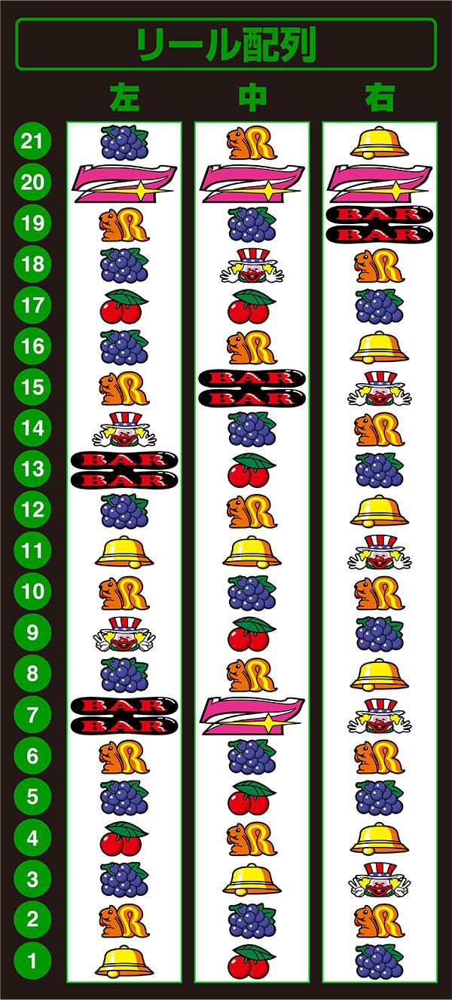
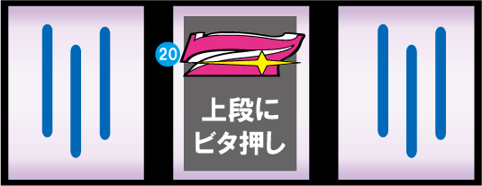
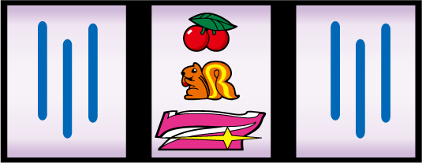
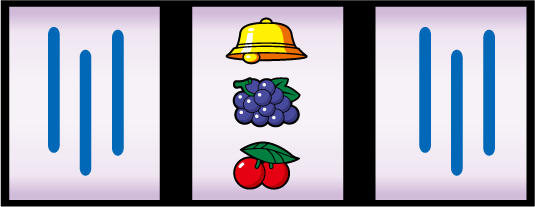

# ハッピージャグラーVⅢ | 中押しガイド

中押しは全役のフォローができる打ち方で、ボーナス察知もできる打ち方である。

## リール配列

## 打ち方

**20番の`7`を上段ビタ押し**

中リールには`7`が2つあり、この2つを見極めてビタ押しを行うのは難しい。

おすすめの狙い方として、`15`番の`BAR`を枠下に押すイメージで打つと良い。

**上段`7`停止時**

成立役: `ブドウ、ピエロ、ボーナス`

中リール上段に`7`が止まったら、右リールフリー打ち。

右リール下段にブドウが止まった場合、左リールフリー打ちでブドウが揃う。

もしもブドウが揃わなければ、ボーナスである。

右リール下段にピエロが止まった場合、枠内に`BAR`目押しでピエロを揃える。

そして右リール下段に上記の図柄が止まらなかった場合、ボーナス2確目となる。

その場合、左リールにチェリーを狙い、レアチェリーをフォローする打ち方をすると良い。

しかしボーナス2確目にも例外があり、右リールにボーナス図柄が止まった場合、ピエロこぼしの可能性がある。

左リールを止めてペカらなかったらピエロこぼしである（泣）

**中段`7`停止時**

成立役: `チェリー、ボーナス、1枚役`

中リール中段に`7`が揃った場合、右リールフリー打ち。

左リールに`17`番のチェリーを狙いチェリーをフォローする。

おすすめの狙い方は、枠上上あたりに`7`を目押しする。

左枠内にチェリーが止まってペカったらチェリー重複ボーナス、ぺからなければ非重複チェリーとなる。

左枠内にチェリーが止まらなかった場合、ボーナスである。

左枠内にチェリーが止まらずペカらなかった場合、チェリーこぼしである。

そして一直線に`ピエロ、7、ピエロ`が揃った場合、1枚役成立で`BIG`である‼️

**下段`7`停止時**

成立役: `ハズレ、リプレイ、ボーナス`

中リール下段に`7`が止まった場合、右左フリー打ちでOK。

大体ハズレかリプレイだが、ここからペカるケースもある。その場合おそらく`BIG`だと思う。

**上段`ベル`停止時**

成立役: `ベル、ボーナス、1枚役`

中リール上段に`ベル`が止まった場合、できれば右リールボーナス図柄を狙う。

右リール上段にベルが止まった場合、左リール上段にベルを狙う。

おすすめの狙い方として`7`を枠内に目押しする。

右リール上段にベル以外が止まった場合、ボーナス2確目である。

一応左リールにチェリーを狙って、役をフォローする。

右リール上段に`7`が止まった場合、左リールに`11`番のベルを目押しする。

左リール上段に`11`番のベルが止まった場合、1枚役成立で`BIG`である。

おすすめの狙い方として`7`の次の`BAR`図柄を枠内に目押しする。

## まとめ

ハッピージャグラーの中押しは、ベルピエロをフォローできるだけでなく、2確目を楽しめるジャグラーとしては少し変わった打ち方でもある。

例えば、中リール上段`7`でブドウピエロ非テンパイの2確目や、ブドウテンパイハズレでボーナス。

中リール中段`7`で第3左リールチェリー狙いで、ネジってペカるかどうかや、

中リール上段`ベル`で右リール上段`7`が止まって、左リールに`11`番のベルを狙って止まるかどうかなど、Aタイプっぽい楽しみ方のできる打ち方でもある。

毎ゲーム中リールにビタが要求される打ち方で、疲れたり面倒だったりするが、Aタイプみたいに出目で楽しむジャグラーを体感してほしい。

## 参考URL

https://p-town.dmm.com/specials/2838#report-index-48138

## リール画像

https://p-town.dmm.com/machines/4230
