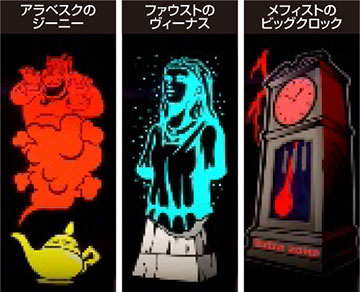

# ハイパーラッシュ | 解析、設定

ここでは、「パチスロハイパーラッシュ」の機種解析と設定判別などがまとめられています。

「SハイパーラッシュSLC8」は2024年9月17日にセブンリーグ（山佐）から導入された擬似ボーナスタイプのAT機です。

4号機のハイパーラッシュから約24年ぶり（2000年導入）に出てきたということに驚き。

本家サイトはこちら。

https://www1.yamasa.co.jp/nwhpr/

## リール画像

画像は「[DMM ぱちタウン](https://p-town.dmm.com/machines/4617)」様からお借りしております。

## ボーナス確率、機械割

ボーナス確率は以下のとおり。
設定がよくなるほどボーナス合算が良い。BR比率に差はなし。

| 設定 | BIG確率 | REG確率 | ボーナス合算 |
| ---- | ------- | ------- | ------------ |
| 1    | 1/259.3 | 1/527.3 | 1/173.8      |
| 2    | 1/254.1 | 1/511.8 | 1/169.8      |
| 3    | 1/243.6 | 1/489.0 | 1/162.6      |
| 4    | 1/233.9 | 1/468.6 | 1/156.0      |
| 5    | 1/225.7 | 1/450.1 | 1/150.3      |
| 6    | 1/216.5 | 1/430.5 | 1/144.0      |

機械割は以下のとおり。
設定1でも完全攻略で100%超える。

| 設定 | 機械割 | 完全攻略 |
| ---- | ------ | -------- |
| 1    | 98.9%  | 100.5%   |
| 2    | 99.9%  | 101.5%   |
| 3    | 102.0% | 103.7%   |
| 4    | 104.0% | 106.2%   |
| 5    | 105.9% | 108.6%   |
| 6    | 108.1% | 111.0%   |

## 設定推測

ハイパラの設定推測は、トロフィー＞PUSHボタン＞ボーナスフラグ＞子役確率の順番で予測を立てると良いかも。

設定が2以上であればPUSHボタンのDynamite!（設定2以上濃厚）が出てくれるイメージ。
結構示唆はしてくれると思う。

ボーナスフラグは合算で予想を立てると良いかも。`N,W`は要チェックだね。

子役確率は結構ブレるからあまり意味はないかも。

### ケロットトロフィー

たまにボーナス終了画面でケロットトロフィーが出てくる。

| 種類       | 示唆      |
| ---------- | --------- |
| 銅         | 設定2以上 |
| 銀         | 設定3以上 |
| 金         | 設定4以上 |
| ケロット柄 | 設定5以上 |
| 虹         | 設定6     |

### ベル、スイカ確率

子役確率はわずかながら設定差がある。

ベル、スイカ共に`A,B`の2種類があるが、合算で推測すると良い。

| 設定 | ベル合算 | スイカ合算 |
| ---- | -------- | ---------- |
| 1    | 1/10.2   | 1/99.1     |
| 2    | 1/10.1   | 1/98.4     |
| 3    | 1/10.0   | 1/97.7     |
| 4    | 1/9.8    | 1/95.7     |
| 5    | 1/9.7    | 1/93.6     |
| 6    | 1/9.6    | 1/91.8     |

### リーチ目フラグ

設定差のあるリーチ目フラグは、`B,C,D,E,G,N,Q,T,W`の9種類。

その中でも`N,W`の差が大きく要チェックで、合算値で推測してもよい。

#### BIGフラグ

| 設定 | フラグB  | フラグC  | フラグD  | フラグE  | フラグG  | フラグN   |
| ---- | -------- | -------- | -------- | -------- | -------- | --------  |
| 1    | 1/8192.0 | 1/3855.1 | 1/3855.1 | 1/1489.5 | 1/2185.5 | 1/16384.0 |
| 2    | 1/8192.0 | 1/3640.9 | 1/3640.9 | 1/1456.4 | 1/2114.1 | 1/16384.0 |
| 3    | 1/8192.0 | 1/3120.8 | 1/3276.8 | 1/1394.4 | 1/2048.0 | 1/10922.7 |
| 4    | 1/5461.3 | 1/2978.9 | 1/2978.9 | 1/1365.3 | 1/1985.9 | 1/10922.7 |
| 5    | 1/5461.3 | 1/2849.4 | 1/2730.7 | 1/1310.7 | 1/1872.5 | 1/8192.0  |
| 6    | 1/5461.3 | 1/2621.4 | 1/2520.6 | 1/1260.3 | 1/1820.4 | 1/5461.3  |

#### REGフラグ

| 設定 | フラグQ  | フラグT  | フラグW  |
| ---- | -------- | -------- | -------- |
| 1    | 1/9362.3 | 1/6553.6 | 1/1040.3 |
| 2    | 1/8192.0 | 1/5957.8 | 1/993.0  |
| 3    | 1/7281.8 | 1/5461.3 | 1/923.0  |
| 4    | 1/5957.8 | 1/4681.1 | 1/873.8  |
| 5    | 1/5461.3 | 1/4369.1 | 1/819.2  |
| 6    | 1/5041.2 | 1/3640.9 | 1/780.2  |

#### 設定差のあるフラグ合算

| 設定 | 合算    |
| ---- | ------- |
| 1    | 1/327.7 |
| 2    | 1/313.6 |
| 3    | 1/290.0 |
| 4    | 1/269.7 |
| 5    | 1/253.0 |
| 6    | 1/235.7 |

### PUSHボイス（ボーナス終了後）

ボーナス終了時にPUSHボタンを押すと設定示唆を見ることができる。

おそらくだが、パネフラ時は期待度高めだと思う。

| ボイス        | ランプ | 示唆          |
| ------------- | ------ | ------------- |
| Turn it up!   | 白     | デフォルト    |
| GOOD          | 青     | 奇数設定示唆  |
| NICE!         | 黄     | 偶数設定示唆  |
| COOL!         | 紫     | 高設定示唆弱  |
| It's on fire! | 赤     | 高設定示唆強  |
| Dynamite!     | 赤点滅 | 設定2以上濃厚 |
| PERFECT!!!    | 虹     | 設定4以上濃厚 |

## 解析情報

子役確率のリプBベルBは、演出モードをマニアックで演出発生時に、リプベルが停止すれば必ずBとなる。
スイカBは順押し時に、斜めに揃いやすいかも。

リーチ目フラグは、各フラグごとに停止形や演出頻度などが違うのが面白い。
REGだった場合、直揃えしやすい。

テトラ演出は、演出法則と子役の停止形を覚えておくと面白い。
あとプレミア演出、見てみたい。

### 子役確率

| 設定 | リプB   | ベルA  | ベルB   | チェリー | スイカA   | スイカB  |
| ---- | ------- | ------ | ------- | -------- | --------- | -------- | 
| 1    | 1/364.1 | 1/10.4 | 1/516.0 | 1/58.0   | 1/108.3   | 1/1170.3 |
| 2    | -       | 1/10.3 | -       | -        | 1/107.4   | -        |
| 3    | -       | 1/10.2 | -       | -        | 1/106.6   | -        |
| 4    | -       | 1/10.0 | -       | -        | 1/104.2   | -        |
| 5    | -       | 1/9.9  | -       | -        | 1/101.8   | -        |
| 6    | -       | 1/9.7  | -       | -        | 1/99.6    | -        |

子役ABの違いは主に消灯演出や出目でわかる。

リプレイは1消灯でA、2消灯でB。

ベルは1消灯でA、2消灯でB。

スイカは2消灯でA、3消灯でB。

### リーチ目フラグ

| フラグ | 設定1     | 設定2     | 設定3     | 設定4     | 設定5     | 設定6     |
| ------ | --------- | --------- | --------- | --------- | --------- | --------- |
| A      | 1/4096.0  | -         | -         | -         | -         | -         |
| B      | 1/8192.0  | -         | -         | 1/5461.3  | -         | -         |
| C      | 1/3855.1  | 1/3640.9  | 1/3120.8  | 1/2978.9  | 1/2849.4  | 1/2621.4  |
| D      | 1/3855.1  | 1/3640.9  | 1/3276.8  | 1/2978.9  | 1/2730.7  | 1/2520.6  |
| E      | 1/1489.5  | 1/1456.4  | 1/1394.4  | 1/1365.3  | 1/1310.7  | 1/1260.3  |
| F      | 1/3276.8  | -         | -         | -         | -         | -         |
| G      | 1/2184.5  | 1/2114.1  | 1/2048.0  | 1/1985.9  | 1/1872.5  | 1/1820.4  |
| H      | 1/2730.7  | -         | -         | -         | -         | -         |
| I      | 1/16384.0 | -         | -         | -         | -         | -         |
| J      | 1/5041.2  | -         | -         | -         | -         | -         |
| K      | 1/16384.0 | -         | -         | -         | -         | -         |
| L      | 1/2730.7  | -         | -         | -         | -         | -         |
| M      | 1/16384.0 | -         | -         | -         | -         | -         |
| N      | 1/16384.0 | -         | 1/10922.7 | -         | 1/8192.0  | 1/5461.3  |
| O      | 1/9362.3  | -         | -         | -         | -         | -         |
| P      | 1/16384.0 | -         | -         | -         | -         | -         |
| Q      | 1/9362.3  | 1/8192.0  | 1/7281.8  | 1/5957.8  | 1/5461.3  | 1/5041.2  |
| R      | 1/6553.6  | -         | -         | -         | -         | -         |
| S      | 1/16384.0 | -         | -         | -         | -         | -         |
| T      | 1/6553.6  | 1/5957.8  | 1/5461.3  | 1/4681.1  | 1/4369.1  | 1/3640.9  |
| U      | 1/2849.4  | -         | -         | -         | -         | -         |
| V      | 1/3276.8  | -         | -         | -         | -         | -         |
| W      | 1/1040.3  | 1/993.0   | 1/923.0   | 1/873.8   | 1/819.2   | 1/780.2   |

#### リーチ目フラグ、特徴

| フラグ | 特徴                                  |
| ------ | ------------------------------------- |
| A      | BB濃厚の形になりやすい                |
| B      | ハズレ目逆転形が出やすい              |
| C      | リプレイハズレが出やすい              |
| D      | ベルハズレが出やすい                  |
| E      | スイカハズレが出やすい                |
| F      | チャンス目の形になりやすい            |
| G      | スイカハズレが出やすい                |
| H      | セッション目/ハズレ目逆転形が出やすい |
| I      | リーチ目13枚役                        |
| J      | チェリー対角が出やすい                |
| K      | 中段チェリーが出やすい                |
| L      | セッション目/スイカハズレが出やすい   |
| M      | リーチ目リプレイ                      |
| N      | リーチ目ベル                          |
| O      | リーチ目リプレイ                      |
| P      | リーチ目ベル                          |
| Q      | リーチ目チェリー                      |
| R      | リーチ目リプレイ                      |
| S      | リーチ目ベル                          |
| T      | リーチ目チェリー                      |
| U      | ハズレ目逆転形が出やすい              |
| V      | リプレイハズレが出やすい              |
| W      | スイカハズレが出やすい                |

### テトラ演出

個人的な熱い演出としては、「子役ナビ高音レバーオン、Wナビ、逆回転、レベルゲージ」とかかな。

あとは「高音テトラ回りっぱ」とかもいい。

#### 子役ナビ

| パターン             | 法則         |
| -------------------- | ------------ |
| 低音、レバー         | ボーナス濃厚 |
| 低音、第1            | デフォルト   |
| 高音、レバー、リプ   | 期待度50%    |
| 高音、レバー、ベル   | 期待度50%    |
| 高音、レバー、スイカ | 期待度70%    |
| 高音、第1            | ボーナス濃厚 |

#### Wナビ

| パターン        | 法則         |
| --------------- | ------------ |
| レバー          | ボーナス濃厚 |
| 第1、リプベル   | 期待度50%    |
| 第1、ベルスイカ | 期待度75%    |

#### ジュークボックス

| パターン         | 法則         |
| ---------------- | ------------ |
| 高音、第1        | ボーナス濃厚 |
| 低音、第1、赤    | ボーナス濃厚 |
| 高音、レバー、黄 | 期待度32%    |
| 高音、レバー、青 | 期待度17%    |
| 高音、レバー、赤 | 期待度5%     |

#### ヒカル

| パターン    | 法則         |
| ----------- | ------------ |
| 高音、第1   | デフォルト   |
| 高音、第3   | 期待度25%    |
| 逆回転、第1 | 期待度25%    |
| 逆回転、第3 | 期待度66%    |

**フラッシュパターン**

| パターン              | 対応役         |
| --------------------- | -------------- |
| クロスステップ(CROSS) | ハズレ         |
| ウェーブ(WAVE)        | リプレイ       |
| ターンステップ(TURN)  | ベル、チェリー |
| バックスピン(BACK)    | スイカ         |
| バタフライ(BUTTERFLY) | チャンス       |

#### T.J.

| パターン    | 法則         |
| ----------- | ------------ |
| 低音、第1   | デフォルト   |
| 低音、第3   | デフォルト   |
| 高音、第1   | ボーナス濃厚 |
| 高音、第3   | 期待度55%    |
| 逆回転、第1 | ボーナス濃厚 |
| 逆回転、第3 | 期待度70%    |

**アクション**

| パターン                         | 期待度       |
| -------------------------------- | ------------ |
| テトラスピン(TETRA)              | 低い         |
| リバース(REVERSE)                | チャンス     |
| バックトゥバック(BACK)           | チャンス     |
| スクラッチ(SCRATCH)              | 低い         |
| スローミックス(SLOW)             | 高い         |
| フィーチャリングセブン(feat.7)   | ボーナス濃厚 |
| ダンス！(DANCE!)                 | ボーナス濃厚 |

#### レベルゲージ

ボーナス期待度は、33%

| ステップ | 対応役       |
| -------- | ------------ |
| SU1      | -            |
| SU2      | リプレイ     |
| SU3      | ベル、スイカ |
| SU4      | ボーナス濃厚 |

#### 消灯演出

消灯時はチャンス目がないので、第2,3消灯時の子役ハズレはボーナスということかな。

| 消灯 | ハズレ | リプA | リプB | ベルA | ベルB | スイカA | スイカB | チェリー | チャンス目 |
| ---- | ------ | ----- | ----- | ----- | ----- | ------- | ------- | -------- | ---------- |
| 1    | ⚪︎     | ⚪︎    |       | ⚪︎    |       |         |         | ⚪︎       |            |
| 2    |        |       | ⚪︎    |       | ⚪︎    | ⚪︎      |         |          |            |
| 3    |        |       |       |       |       |         | ⚪︎      |          |            |

#### その他の演出

強予告音は、期待度40%

通常時の逆押しナビは、発生した時点でHBB濃厚。前兆中にリーチ目役を引いた際に発生するっぽい。

プレミアム演出は、レバー音で以下の画像（演出）が出ればHBB濃厚。
対応役はリーチ目役。

画像は「[ちょんぼりすた](https://chonborista.com/slot/yamasa-slot/217159/#index-26)」様から拝借しています。

## まとめ

ハイパラはやはり面白い。

## 参考サイト

本家サイト

https://www1.yamasa.co.jp/nwhpr/

リール画像、確率、設定判別など

https://p-town.dmm.com/machines/4617

テトラ演出、プレミアム画像

https://chonborista.com/slot/yamasa-slot/217159/

消灯演出、マニアックモード

https://yamasa-next.co.jp/slot/hpradio/
