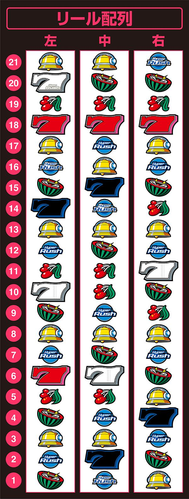

# ハイパーラッシュ | 解析、設定

ここでは、「パチスロハイパーラッシュ」の機種解析と設定判別などがまとめられています。

「SハイパーラッシュSLC8」は2024年9月17日にセブンリーグ（山佐）から導入された擬似ボーナスタイプのAT機です。

4号機のハイパーラッシュから約24年ぶり（2000年導入）に出てきたということに驚き。

本家サイトはこちら。

https://www1.yamasa.co.jp/nwhpr/

## リール画像

画像は「DMM ぱちタウン」様からお借りしております。

https://p-town.dmm.com/machines/4617

## ボーナス確率、機械割

ボーナス確率は以下のとおり。
設定がよくなるほどボーナス合算が良い。BR比率に差はなし。

| 設定 | BIG確率 | REG確率 | ボーナス合算 |
| ---- | ------- | ------- | ------------ |
| 1    | 1/259.3 | 1/527.3 | 1/173.8      |
| 2    | 1/254.1 | 1/511.8 | 1/169.8      |
| 3    | 1/243.6 | 1/489.0 | 1/162.6      |
| 4    | 1/233.9 | 1/468.6 | 1/156.0      |
| 5    | 1/225.7 | 1/450.1 | 1/150.3      |
| 6    | 1/216.5 | 1/430.5 | 1/144.0      |

機械割は以下のとおり。
設定1でも完全攻略で100%超える。

| 設定 | 機械割 | 完全攻略 |
| ---- | ------ | -------- |
| 1    | 98.9%  | 100.5%   |
| 2    | 99.9%  | 101.5%   |
| 3    | 102.0% | 103.7%   |
| 4    | 104.0% | 106.2%   |
| 5    | 105.9% | 108.6%   |
| 6    | 108.1% | 111.0%   |

## 設定推測

ハイパラの設定推測は、PUSHボタン＞ボーナスフラグ＞子役確率の順番で予測を立てると良いかも。

設定が2以上であればPUSHボタンのDynamite!（設定2以上濃厚）が出てくれるイメージ。
結構示唆はしてくれると思う。

ボーナスフラグは合算で予想を立てると良いかも。`N,W`は要チェックだね。

子役確率は結構ブレるからあまり意味はないかも。

### ベル、スイカ確率

子役確率はわずかながら設定差がある。

ベル、スイカ共に`A,B`の2種類があるが、合算で推測すると良い。

| 設定 | ベル合算 | スイカ合算 |
| ---- | -------- | ---------- |
| 1    | 1/10.2   | 1/99.1     |
| 2    | 1/10.1   | 1/98.4     |
| 3    | 1/10.0   | 1/97.7     |
| 4    | 1/9.8    | 1/95.7     |
| 5    | 1/9.7    | 1/93.6     |
| 6    | 1/9.6    | 1/91.8     |

### リーチ目フラグ

設定差のあるリーチ目フラグは、`B,C,D,E,G,N,Q,T,W`の9種類。

その中でも`N,W`の差が大きく要チェックで、合算値で推測してもよい。

#### BIGフラグ

| 設定 | フラグB  | フラグC  | フラグD  | フラグE  | フラグG  | フラグN   |
| ---- | -------- | -------- | -------- | -------- | -------- | --------  |
| 1    | 1/8192.0 | 1/3855.1 | 1/3855.1 | 1/1489.5 | 1/2185.5 | 1/16384.0 |
| 2    | 1/8192.0 | 1/3640.9 | 1/3640.9 | 1/1456.4 | 1/2114.1 | 1/16384.0 |
| 3    | 1/8192.0 | 1/3120.8 | 1/3276.8 | 1/1394.4 | 1/2048.0 | 1/10922.7 |
| 4    | 1/5461.3 | 1/2978.9 | 1/2978.9 | 1/1365.3 | 1/1985.9 | 1/10922.7 |
| 5    | 1/5461.3 | 1/2849.4 | 1/2730.7 | 1/1310.7 | 1/1872.5 | 1/8192.0  |
| 6    | 1/5461.3 | 1/2621.4 | 1/2520.6 | 1/1260.3 | 1/1820.4 | 1/5461.3  |

#### REGフラグ

| 設定 | フラグQ  | フラグT  | フラグW  |
| ---- | -------- | -------- | -------- |
| 1    | 1/9362.3 | 1/6553.6 | 1/1040.3 |
| 2    | 1/8192.0 | 1/5957.8 | 1/993.0  |
| 3    | 1/7281.8 | 1/5461.3 | 1/923.0  |
| 4    | 1/5957.8 | 1/4681.1 | 1/873.8  |
| 5    | 1/5461.3 | 1/4369.1 | 1/819.2  |
| 6    | 1/5041.2 | 1/3640.9 | 1/780.2  |

#### 設定差のあるフラグ合算

| 設定 | 合算    |
| ---- | ------- |
| 1    | 1/327.7 |
| 2    | 1/313.6 |
| 3    | 1/290.0 |
| 4    | 1/269.7 |
| 5    | 1/253.0 |
| 6    | 1/235.7 |

### PUSHボイス（ボーナス終了後）

ボーナス終了時にPUSHボタンを押すと設定示唆を見ることができる。

おそらくだが、パネフラ時は期待度高めだと思う。

| ボイス        | ランプ | 示唆          |
| ------------- | ------ | ------------- |
| Turn it up!   | 白     | デフォルト    |
| GOOD          | 青     | 奇数設定示唆  |
| NICE!         | 黄     | 偶数設定示唆  |
| COOL!         | 紫     | 高設定示唆弱  |
| It's on fire! | 赤     | 高設定示唆強  |
| Dynamite!     | 赤点滅 | 設定2以上濃厚 |
| PERFECT!!!    | 虹     | 設定4以上濃厚 |

## 解析情報

### 子役確率

### リーチ目フラグ

### テトラ演出

## まとめ
