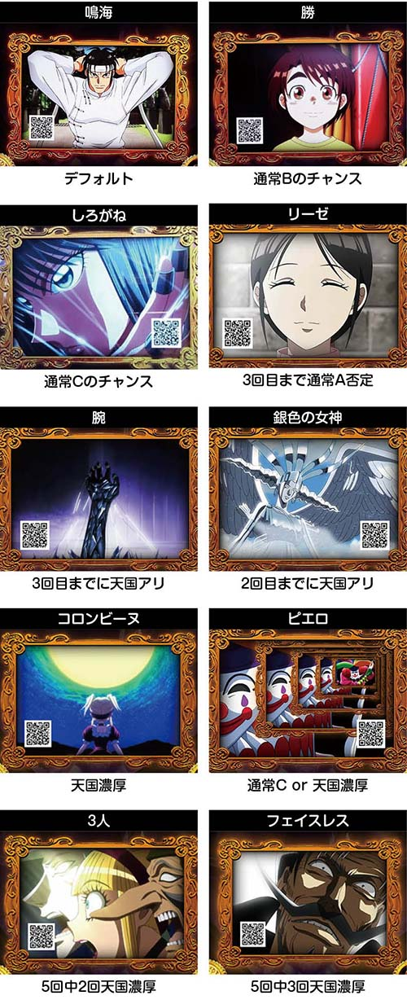

# パチスロ からくりサーカス | 機種解析

2023年7月3日に導入されたLからくりサーカス。

ここでは本機の解析情報をまとめています。
この機種にはモード示唆、からくりレア役、など様々な示唆がありややこしいので、それをまとめる記事となっています。

またこういった機種のことを知ることで、より楽しんで遊技できるのではないかと思って書いているところもあります。

## リール画像

## 子役確率

| 子役          | 確率  |
| ------------- | ----- |
| 押し順ベル    | 1/3   |
| 色押しベル    | 1/3   |
| リプレイ      | 1/7   |
| 3枚ベル       | 1/24  |
| 1枚役         | 1/49  |
| 弱チェリー    | 1/98  |
| スイカ        | 1/100 |
| チャンスベル  | 1/150 |
| 強チェリー    | 1/327 |
| チャンス目A   | 1/350 |
| チャンス目B   | 1/350 |
| 弱レア役合算  | 1/37  |
| 強レア役合算  | 1/114 |
| レア役合算    | 1/28  |

押し順ベル、色押しベル取りこぼし時は1枚払出し。

3枚ベルの一部で「中リールを狙え」発生。

AT中、レア役の一部で「赤7＆青7を狙え」が発生。

子役確率は全設定共通。

## モード

通常時は4種類のモードが存在し、既定ゲーム数での`CZ, AT`当選を管理。

| モード | 特徴 |
| ------ | -------- |
| 通常A  | 天井1200G、100の位の偶数がチャンス |
| 通常B  | 天井800G、100の位の奇数がチャンス。次回通常C以上の期待度アップ |
| 通常C  | 天井1200G、100の位の偶数がチャンス。ゲーム数当選でAT直撃 |
| 天国   | 天井100G |

### モード以降抽選

モードは設定変更時、エンディング後などに「5回先のモード」まで抽選で決められている。

以降は1回目のモード消化後に6回目を抽選する流れ。

モード抽選の特徴

- 通常B後は通常Cや天国が選択されやすい
- 設定変更、エンディング後は1回目が通常Cになりやすい
- 超カラクリサーカスの運命の一劇失敗後は1回目が天国になりやすい

## CZ終了画面の示唆

有利区間リセットされた場合、示唆は無効となる。

## ワイプ演出

前兆失敗時や`CZ, AT`終了時の画面切り替わり時のワイプ演出に既定ゲーム数を示唆するパターンがある。

| パターン | 示唆 |
| -------- | ---- |
| スポットライトなし | デフォルト |
| スポットライトあり | 400G以内のCZのチャンス |
| しろがね（シルエット） | 200G以内のCZ以上濃厚 |
| しろがね（アップ）     | 100G以内のCZ以上濃厚 |

しろがねが出現したらヤメないでおいた方が良いかも。
スポットライトはあまり当てにならない。

## からくりレア役

リプレイ・チェリー・スイカ・チャンス目が規定回数成立すると、「からくりレア役」として抽選が行われる。

規定回数が近づくと左上にカウンターが出現し、からくりレア役出現時はマリオネット演舞・CZ・ATの抽選が行われる。

**からくりレア役の抽選内容**

- マリオネット演舞
- 機械仕掛けの神
- 幕間チャンス
- AT直撃
- AT＋運命の一劇
- ロングフリーズ

**規定回数時の恩恵振り分け**

| 恩恵   | リプ、弱チェ | 強チェ | チャン目 | スイカ |
| ----   | ------------ | ------ | -------- | ------ |
| 演舞   | 99%          | -      | -        | -      |
| 機械CZ | -            | 79%    | 99%      | -      |
| 幕間CZ | -            | -      | -        | 99%    |
| AT     | 1%           | 21%    | 1%       | 1%     |

上記の一部でロンフリ発生。強チェリー、チャンス目契機の一部でAT＋運命の一劇権利獲得。

### カウンター表示の法則

| 子役       | 法則            |
| ---------- | --------------- |
| リプレイ   | 残り3回から表示 |
| 弱チェリー | 残り1回から表示 |
| スイカ     | 残り1回から表示 |
| 強チェリー | 残り1回から表示 |
| チャンス目 | 残り1回から表示 |

からくりレア役の法則が違えば...

### 規定回数示唆

液晶左上に示唆がなくても、その他演出でからくりレア役が近いことを示唆しているので要チェック。

**BETボイス**

| ボイス           | 示唆        |
| ---------------- | ----------- |
| この気配は       | 残り5回以内 |
| 近づいています   | 残り3回以内 |
| 次で決めましょう | 残り1回     |

**会話演出**

| 会話   | 示唆        |
| ------ | ----------- |
| 白文字 | 残り5回以内 |
| 青文字 | 残り3回以内 |

主にリプレイ時に発生。「〇〇に何かを〜」「〇〇の歯車が〜」といったセリフが発生すればからくりレア役が近い。

**幕間煽り**

| 演出                 | 示唆        |
| -------------------- | ----------- |
| 液晶左右の幕が揺れる | 残り3回以内 |

主にスイカ時に発生。期待度75%。

## まとめ

いかがだったでしょうか。これらの示唆を覚えておくことで暇な通常時も少しはマシになるのではないでしょうか（からくりの通常時は地獄）。

子役確率を覚えておくだけでも、AT中もより熱く打てるのではないかと思います。

ここまで読んでいただきありがとうございました！

## 公式サイト

https://www.sankyo-fever.jp/products/machine_list/spx/

## 機種解析サイト

https://chonborista.com/slot/sankyo-slot/187795/

## リール画像

https://p-town.dmm.com/machines/4360
