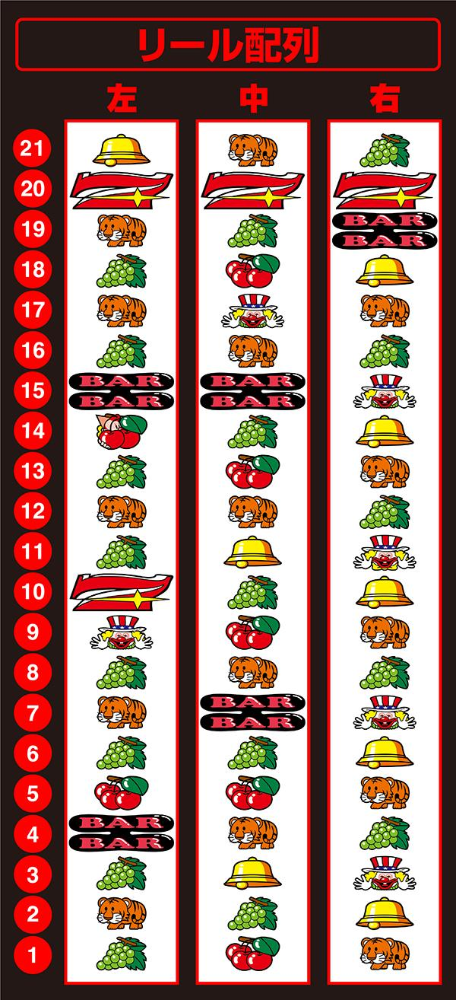

# マイジャグラーV | 設定判別

2021年12月06日に登場したマイジャグラーV。競争率の高いジャグラーです🤡

ここでは、マイジャグラーVの設定推測に役立つ数値についてまとめられています。

## リール配列

## ボーナス確率

| 設定 | BIG確率 | REG確率 | ボーナス合算 |
| ---- | ------- | ------- | ------------ |
| 1    | 1/273.1 | 1/409.6 | 1/163.8      |
| 2    | 1/270.8 | 1/385.5 | 1/159.1      |
| 3    | 1/266.4 | 1/336.1 | 1/148.6      |
| 4    | 1/254.0 | 1/290.0 | 1/135.4      |
| 5    | 1/240.1 | 1/268.6 | 1/126.8      |
| 6    | 1/229.1 | 1/229.1 | 1/114.6      |

`6`はボーナスの割合が`1:1`‼️

## 機械割

| 設定 | 機械割1 | 機械割2 | 機械割3 |
| ---- | ------- | ------- | ------- |
| 1    | 97.00%  | 97.84%  | 98.61%  |
| 2    | 98.00%  | 99.80%  | 99.73%  |
| 3    | 99.90%  | 100.80% | 101.97% |
| 4    | 102.80% | 103.84% | 105.09% |
| 5    | 105.30% | 106.55% | 107.97% |
| 6    | 109.40% | 110.45% | 112.44% |

機械割1: メーカー発表値

機械割2: チェリー狙い

機械割3: フル攻略（チェリー・ピエロ・ベル狙い・ブドウ抜き）

マイジャグは設定`6`の機械割がとても高い⤴️

## 子役確率

| 設定 | ブドウ | チェリー |
| ---- | ------ | -------- |
| 1    | 1/5.90 | 1/38.10  |
| 2    | 1/5.85 | 1/38.10  |
| 3    | 1/5.80 | 1/36.82  |
| 4    | 1/5.78 | 1/35.62  |
| 5    | 1/5.76 | 1/35.62  |
| 6    | 1/5.66 | 1/35.62  |

ピエロ・ベル確率：1/1024

チェリー確率は`4~6`で同じ。

## BIG確率

| 設定 | 単独BIG  | チェリーBIG |
| ---- | -------- | ----------- |
| 1    | 1/420.10 | 1/1365.33   |
| 2    | 1/414.78 | 1/1365.33   |
| 3    | 1/404.54 | 1/1365.33   |
| 4    | 1/376.64 | 1/1365.33   |
| 5    | 1/348.60 | 1/1337.47   |
| 6    | 1/341.33 | 1/1129.93   |

チェリーBIG確率は`1~4`まで同じ。

## REG確率

| 設定 | 単独REG  | チェリーREG |
| ---- | -------- | ----------- |
| 1    | 1/655.36 | 1/1092.27   |
| 2    | 1/595.78 | 1/1092.27   |
| 3    | 1/496.48 | 1/1040.25   |
| 4    | 1/404.54 | 1/1024.00   |
| 5    | 1/390.10 | 1/862.32    |
| 6    | 1/352.34 | 1/762.05    |

単独REGは`1~4`までに大きな差がある。

チェリーREGは`4`と`5`で最も差がある。

## 設定判別

REG確率に大きな設定差アリ‼️

特に単独REG確率は設定差が大きいので要チェック‼️

設定が上を見込めるようなら、チェリーREGもチェック‼️

ブドウとチェリーも数えておくと良いかも。

## 公式サイト

https://www.kitadenshi.co.jp/products/2021/myj5/

## 機種解析サイト

https://jug123.com/my5spec/

## リール画像

https://p-town.dmm.com/machines/4029
