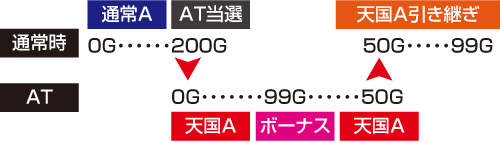
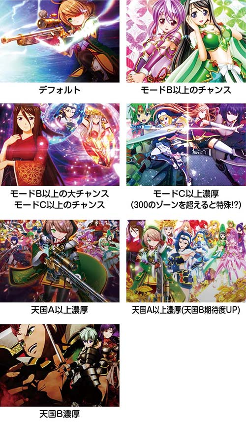
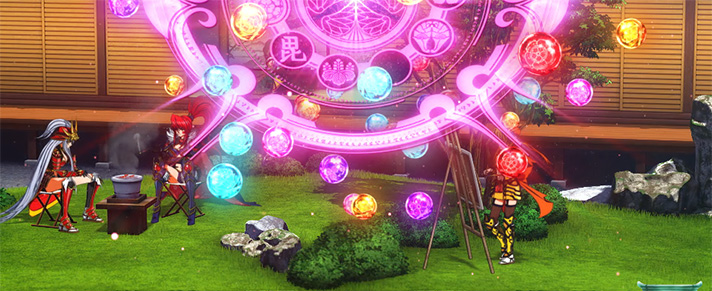

# L戦国乙女4 戦乱に閃く炯眼の軍師 | 機種解析

オリンピアエステートから2023年9月4日導入された戦国乙女4。

2024年6月現在でも非常に人気の機種。
ここでは本機の解析情報をまとめています。

それでは見ていきましょう！

## AT確率・機械割

| 設定 | 初当り  | CZ      | AT初当り | 機械割 | 
| ---- | ------- | ------- | -------- | ------ |
| 1    | 1/272.7 | 1/467.6 | 1/429.2  | 98.2%  |
| 2    | 1/267.3 | 1/452.2 | 1/417.8  | 99.0%  |
| 3    | 1/255.3 | 1/434.7 | 1/393.6  | 101.2% |
| 4    | 1/238.2 | 1/410.9 | 1/361.3  | 105.2% |
| 5    | 1/223.2 | 1/394.9 | 1/334.1  | 110.2% |
| 6    | 1/217.1 | 1/381.5 | 1/319.2  | 113.0% |

## ゲームフロー

通常時は巫女カウンターでの周期抽選から乙女アタックを目指すか、規定ゲーム数消化で戦国乙女BONUSを目指す。

乙女アタックは2ゲーム完結のバトルを10戦し、1度でも勝利すれば戦国乙女BONUSに当選。
バトルは完走型となっており、勝利した分だけ戦国乙女BONUSを獲得できる。

戦国乙女BONUSは純増約`2.5枚/G`の擬似ボで、`30~50G`継続。消化中はAT突入抽選が行われる。

AT強カワRUSHは純増約`2.5枚/G`のゲーム数上乗せ型で、消化中はゲーム数上乗せ・高確移行・ボーナスの抽選を行う。
また通常時と同じく規定ゲーム数消化でのボーナス抽選も行っている。
残りゲーム数が0になると引き戻しゾーンのオウガイバトルに移行しAT抽選が行われる。

AT中のボーナスは全て出陣ボーナスになり、消化中は上乗せ高確率状態になる。
出陣するキャラによって上乗せ性能が変化し、白7揃い時に選択されたキャラでボーナスがスタート。

ヨシテル参戦からは純増枚数が約`5.0枚/G`にアップする上位AT真強カワRUSHに突入し、押し順ナビが色目押しとなる。

AT終了後は引き戻しゾーンのオウガイバトルへ移行し、勝利すれば引き戻し。
勝利後は2セット目に突入し、以降は勝利のたびにゲーム数が上乗せされる。

## 打ち方

通常時は左1st推奨。変則推しはペナの可能性あり。

### リール画像

注意として、スイカチャンス目成立時にで右リールBARを狙わないと`3枚`取りこぼす可能性あり。

## 天井

天井は通常`799G+α`消化で戦国乙女BONUS。

戦国乙女BONUS6スルー後、次回エピボ当選。

## 狙い目

狙い目は通常`300G`のゾーン。モード問わず当選しやすい所。

## やめどき

ボーナス後に終了画面確認後ヤメor天国見てやめ。

AT後は引き戻し確認後、ゲーム数見てヤメ。

## 有利区間

エンディング到達や差枚プラスのAT終了時の一部で有利区間がリセット。
`100G`以内のボーナス当選かつ超強カワループに突入。

差枚プラスでの有利区間リセットは、液晶では表示されず内部的に超強カワループに突入する。

## 子役確率

| 子役         | 確率    |
| ------------ | ------- |
| 押し順ベル   | 1/2.0   |
| 共通ベル     | 1/4.4   |
| 押し順3枚役  | 1/7.6   |
| リプレイ     | 1/9.3   |
| スイカ       | 1/69.4  |
| 弱チェリー   | 1/97.2  |
| チャンス目   | 1/180.0 |
| 強チェリー   | 1/319.7 |
| ヤマカン役   | 1/399.6 |
| 弱レア役合算 | 1/40.5  |
| 強レア役合算 | 1/115.2 |
| レア役合算   | 1/30.0  |

ヤマカン役はAT中の押し順チャレンジのこと。

## 通常時の抽選

規定ゲーム数、巫女カウンターのCZ、稀に強レア役のCZ直撃、AT直撃などの抽選を行う。

CZとボーナスの本前兆が被った場合、前兆ゲーム数の早い方から先に出現する。

### AT貫通ゲーム数テーブル

AT中もAT終了後の通常時も規定G数テーブルを引き継ぐ。

つまり天国ループしていればATが終了しても連続当選のチャンスとなる。
AT中にボーナス間でハマって500G消化した状態で終了すればゲーム数カウンター500Gから通常時がスタートする。

## 巫女カウンター

1ゲームにつき`1pt`以上を減算。ゼロになるとCZ乙女アタックを抽選する。

`999pt`減算に必要なゲーム数は平均で約`110G`。

**巫女ポイント減算抽選**

| pt    | ハズレ・ベル | リプ  | 弱チェ・スイカ | チャメ | 強チェ・2段階 |
| ----- | ------------ | ----- | -------------- | ------ | ------------- |
| 1pt   | 87.5%        | -     | -              | -      | -             |
| 5pt   | 12.5%        | -     | -              | -      | -             |
| 10pt  | -            | 87.5% | -              | -      | -             |
| 50pt  | -            | 12.5% | 67.2%          | -      | -             |
| 100pt | -            | -     | 25.0%          | -      | -             |
| 200pt | -            | -     | 6.3%           | 79.3%  | -             |
| 500pt | -            | -     | 1.2%           | 20.3%  | -             |
| 999pt | -            | -     | 0.4%           | 0.4%   | 100%          |

**0pt到達時の乙女アタック当選率**

| 設定 | 当選率 |
| ---- | ------ |
| 1    | 20.3%  |
| 2    | 20.9%  |
| 3    | 21.8%  |
| 4    | 22.9%  |
| 5    | 23.8%  |
| 6    | 24.4%  |

ここには設定差が存在。

**乙女アタック直撃当選率**

| 設定 | 強レア役 |
| ---- | -------- |
| 1    | 1.2%     |
| 2    | 1.3%     |
| 3    | 1.5%     |
| 4    | 1.8%     |
| 5    | 2.1%     |
| 6    | 2.5%     |

強チェ、強チャメ時は巫女カウンター減算とは別に乙女アタックの直撃抽選が行われる。

ここにも設定差があるが、判別が困難である。

## 通常モード

| モード | ゾーン、特徴                                         | 天井   |
| ------ | ---------------------------------------------------- | ------ |
| 通常A  | `200, 300, 400, 600G`がゾーン                        | 799G+α |
| 通常B  | `100, 300, 500G`がゾーン                             | 649G+α |
| 通常C  | `100, 200G`がゾーン                                  | 349G+α |
| 特殊   | ゾーンは通常A。次回天国A、天国Bへ移行（割合は`1:1`） | 799G+α |
| 天国A  | -                                                    | 99G+α  |
| 天国B  | 天国Bが50%でループ。転落時は天国A                    | 99G+α  |

### モード移行抽選

有利区間開始時とボーナス終了時にモードを抽選。
天国の以降期待度は、通常`A<B<C`の順にアップ。

また、1G連で放出されるボーナスにはモード移行抽選が行われない。

### モード示唆画面

ボーナス終了画面で次回のモードを示唆。

## 葵ノ陣

いわゆる穢れ要素のこと。規定ポイント到達した状態で戦国乙女BONUSに当選するとエピボになる。

また葵の陣発動時はヨシテルエピソードの振り分けが`9.0%`と優遇されている。

上記の演出が発生したら追った方がいいかも...

## AT直撃モード

通常モードとは別に、3種類のAT直撃モードがあり、滞在モードに応じてAT直撃、ループ率、上位AT当選率など変化する。

AT直撃は2段階抽選となっていて、まずは毎ゲーム1段階目を抽選。
次に滞在モードを参照して2段階目の抽選でAT直撃or通常転落のいずれかに振り分けられる。

| モード         | 特徴                                                                             |
| -------------- | -------------------------------------------------------------------------------- |
| 通常           | 通常時、確率に大きな設定差が存在                                       |
| 強カワループ   | AT後必ず移行、`10.2%`でATループ                                        |
| 超強カワループ | ED後or差枚約`2000枚`時移行、`70.3%`でATループ。AT当選時の`25%`で上位AT |

### 通常時のAT直撃確率

| 設定 | 確率      |
| ---- | --------- |
| 1    | 1/10922.7 |
| 2    | 1/9362.3  |
| 3    | 1/8192.0  |
| 4    | 1/6553.6  |
| 5    | 1/5957.8  |
| 6    | 1/5461.3  |

超強カワループの当選確率は`1/65536.0`。設定差なし。

### 強カワループ

契機発生抽選確率は`1/10.2`。
契機発生時のAT直撃確率は`10.2%`。
AT開始時の`0.1%`で上位AT。

### 超強カワループ

契機発生抽選確率は`1/14.9`。
契機発生時のAT直撃確率は`70.3%`。
AT開始時の`25%`で上位AT。

### その他

AT直撃当選時の`0.1%`で超強カワループ移行。

有利区間開始時、AT終了時の`0.4%`で次回上位AT。

## 戦国八陣

発生したタイミングによって恩恵が異なるプレミアムアクション。

- 通常時
  - **ボーナスの陣**
    - AT確+オウガイバトルストックor真強カワRUSH
- 乙女アタック全敗時
  - **乙女アタックの陣**
    - プレミアム乙女アタック
    - 発生率は`1/256.0`。
- ボーナス入賞時
  - **ボーナスの陣**
    - エピボ（ヨシテル）
  - **しゅつじんの陣**
    - しゅつじんのとき
- 戦国乙女BONUSAT非当選時
  - **逆転の陣**
    - AT当選
    - 発生率は`1/256.0`
- AT中
  - **上乗せの陣**
    - `+200G`上乗せ。
  - 乙女出陣チャンス時
    - **覚醒の陣**
      - 神謀覚醒
  - オウガイバトル敗北時
    - **復活の陣**
      - 復活+勝利ストック4個以上。

## 乙女アタック

シリーズお馴染みのチャンスゾーン。
2ゲームx10の20G継続し、バトル勝利のたびにボーナスをストック。
強キャラで勝利した場合はエピボ当選！

**対戦相手の抽選（1G目）**

| 対戦相手     | その他 | 弱チェ・スイカ | チャン目 | 強チェ |
| ------------ | ------ | -------------- | -------- | ------ |
| オウガイ     | 60.9%  | -              | -        | -      |
| ムラサメ     | 31.3%  | 50.0%          | -        | -      |
| コタロウ     | 6.3%   | 38.7%          | 72.7%    | 61.7%  |
| 昇格コタロウ | 1.2%   | 10.2%          | 25.0%    | 33.2%  |
| シロ         | 0.4%   | 1.2%           | 2.3%     | 5.1%   |

**勝利抽選（2G目）**

| 子役           | オウガイ | ムラサメ | コタロウ | 昇格コタロウ |
| ------------   | -------- | -------- | -------- | ------------ |
| その他         | 0.4%     | 4.7%     | 40.2%    | 70.3%        |
| 弱チェ・スイカ | 1.2%     | 12.5%    | 100%     | 100%         |
| チャン目       | 50.0%    | 66.4%    | 100%     | 100%         |
| 強チェ         | 66.4%    | 80.1%    | 100%     | 100%         |

### プレミアム乙女アタック

対戦相手がコタロウ以上となる乙女アタック。

1バトルあたりの勝率が40%オーバーとなり、ボーナス大量ストックの大チャンス！

**対戦相手振り分け**

| 対戦相手     | その他 | 弱チェ・スイカ | チャン目 | 強チェ |
| ------------ | ------ | -------------- | -------- | ------ |
| オウガイ     | -      | -              | -        | -      |
| ムラサメ     | -      | -              | -        | -      |
| コタロウ     | 69.9%  | 50.0%          | -        | -      |
| 昇格コタロウ | 25.0%  | 25.0%          | -        | -      |
| シロ         | 5.1%   | 25.0%          | 100%     | 100%   |

### リールロック確率

| 段階     | 確率      |
| -------- | --------- |
| 1段階    | 1/315.6   |
| 2段階    | 1/2481.5  |
| 3段階    | 1/16384.0 |
| トータル | 1/275.3   |

1段階はレア役。

2段階は強レア役で、戦国乙女BONUSを`50%`で抽選、ハズれた場合乙女アタックを`50%`で抽選。

AT中では上乗せ＋ボーナス高確＋出陣ボーナスを`50%`で抽選。

3段階はフリーズ（神謀覚醒）。

## 戦国乙女BONUS

消化中はハズレを含む全役でATを抽選。

### 継続ゲーム数振り分け

| 設定 | 30G   | 40G   | 50G  |
| ---- | ----- | ----- | ---- |
| 1    | 87.5% | 10.2% | 2.3% |
| 2    | 87.1% | 10.3% | 2.5% |
| 3    | 86.3% | 10.9% | 2.7% |
| 4    | 84.7% | 12.1% | 3.1% |
| 5    | 83.5% | 13.0% | 3.5% |
| 6    | 81.1% | 14.1% | 4.7% |

高設定ほど若干だが`40or50G`が選ばれやすい。

**ボーナス準備中の昇格抽選**

| 当選    | 弱レア役 | チャン目 | 強チェ |
| ------- | -------- | -------- | ------ |
| 40G以上 | 0.4%     | 5.1%     | 25.0%  |
| エピボ  | 0.4%     | 1.2%     | 5.1%   |

**AT抽選**

| 成立役     | AT期待度 |
| ---------- | -------- |
| その他     | 1.0%     |
| 弱レア役   | 12.9%    |
| チャン目   | 33.4%    |
| 強チェ     | 55.1%    |

AT当選率に設定差はなし。

**AT確定後**

| 成立役     | ストック当選率 |
| ---------- | -------------- |
| その他     | 0.1%           |
| 弱レア役   | 5.0%           |
| チャン目   | 33.4%          |
| 強チェ     | 55.1%          |

AT確定後はオウガイバトルの勝利ストック抽選。

## エピソードボーナス

AT確定のボーナス。

**準備中の抽選**

| 成立役     | ストック当選率 |
| ---------- | -------------- |
| 弱レア役   | 0.8%           |
| チャン目   | 9.8%           |
| 強チェ     | 29.7%          |

**消化中の抽選**

| 成立役     | ストック当選率 |
| ---------- | -------- |
| その他     | 0.1%     |
| 弱レア役   | 5.0%     |
| チャン目   | 33.4%    |
| 強チェ     | 55.1%    |

## AT強カワRUSH

消化中はレア役で「ゲーム数上乗せ・出陣BONUS・ボーナス高確」を抽選し、規定G数消化での出陣BONUS当選もあり。
G数消化後はオウガイバトルで引き戻しを目指す。

### ゲーム数上乗せ抽選

| 成立役   | 上乗せ期待度 |
| -------- | ------------ |
| スイカ   | 4.6%         |
| 弱チェ   | 20.2%        |
| チャン目 | 100%         |
| 強チェ   | 100%         |

チャン目・強チェは上乗せ＋ボーナス高確。スイカは乗れば`30G`以上確定。

| G数  | 弱チェリー | スイカ | チャン目 | 強チェ | チャン目（2段階） | 強チェ（2段階） |
| ---- | ---------- | ------ | -------- | ------ | ----------------- | --------------- |
| 10G  | 90.2%      | -      | 90.2%    | -      | -                 | -               |
| 20G  | 4.7%       | -      | 4.7%     | 72.7%  | -                 | -               |
| 30G  | 2.3%       | 82.4%  | 2.3%     | 24.6%  | 82.4%             | -               |
| 50G  | 1.6%       | 16.0%  | 1.6%     | 1.6%   | 16.0%             | 83.2%           |
| 100G | 0.4%       | 0.8%   | 0.4%     | 0.4%   | 0.8%              | 14.5%           |
| 150G | 0.4%       | 0.4%   | 0.4%     | 0.4%   | 0.4%              | 1.6%            |
| 200G | 0.4%       | 0.4%   | 0.4%     | 0.4%   | 0.4%              | 0.8%            |

### ボーナス抽選

AT初あたり時のみ約`14%`で出陣ボーナスを抽選。

通常時同様にAT中も規定ゲーム数で出陣BONUSを抽選。

### ボーナス高確移行抽選

| 成立役                    | 移行率 |
| ------------------------- | ------ |
| 押し順ベル、ベル3連       | 3.1%   |
| 弱チェ                    | 1.2%   |
| スイカ                    | 25.0%  |
| チャン目、強チェ、ロック2 | 100%   |

高確は`13G`持続する（意外とスイカは高確移行のチャンス）。

### 出陣BONUS当選率

| 成立役   | 高確  |
| -------- | ----- |
| 弱レア役 | 10.0% |
| チャン目 | 25.0% |
| 強チェ   | 50.0% |
| ロック2  | 100%  |

通常状態のリールロック2段階は出陣BONUS当選率`50%`。

ベルフリーズ確率は`1/7341.2`。

| G数  | 振り分け |
| ---- | -------- |
| 100G | 77.3%    |
| 150G | 12.5%    |
| 200G | 10.2%    |

## オウガイバトル

オウガイに勝利すればAT継続確定。
勝利後は上乗せ特化ゾーンに変わりオウガイに勝利するたびに上乗せ。

規定ゲーム数残り`24G`以内でオウガイバトルに発展した場合は勝利濃厚。

### オウガイバトル1戦目の勝利期待度

| 設定 | 突破率 |
| ---- | ------ |
| 1    | 24.9%  |
| 2    | 25.0%  |
| 3    | 25.5%  |
| 4    | 27.4%  |
| 5    | 30.7%  |
| 6    | 31.7%  |

ここには設定差あり。

### 継続率振り分け

| 継続率 | 振り分け |
| ------ | -------- |
| 50%    | 88.7%    |
| 66%    | 10.2%    |
| 80%    | 1.2%     |

### セット継続時の上乗せ

| 上乗せ | 振り分け |
| ------ | -------- |
| 5G     | 90.6%    |
| 10G    | 7.0%     |
| 20G    | 0.8%     |
| 30G    | 0.8%     |
| 50G    | 0.4%     |
| 100G   | 0.4%     |

### レア役のポイント抽選

| pt | 弱レア役 | チャン目 | 強チェ | ロック2 |
| -- | -------- | -------- | ------ | ------- |
| 0  | 50%      | -        | -      | -       |
| 1  | 49.2%    | 91.8%    | -      | -       |
| 2  | 0.4%     | 6.3%     | 88.3%  | -       |
| 3  | 0.4%     | 1.2%     | 10.2%  | -       |
| 4  | -        | 0.4%     | 1.2%   | 99.6%   |
| 5  | -        | 0.4%     | 0.4%   | 0.4%    |

レア役でポイントを獲得。非継続であれば`1pt`消費して継続書き換え。
残ったポイントがあれば追撃上乗せを抽選。

### セット継続時のポイント抽選

| pt | 振り分け |
| -- | -------- |
| 0  | 99.2%    |
| 2  | 0.4%     |
| 4  | 0.4%     |

当選時は歌が流れるらしい。

### 追撃上乗せ

| G数  | 0,1pt | 2pt   | 3pt   | 4pt   | 5pt   | 6pt  |
| ---- | ----- | ----- | ----- | ----- | ----- | ---- |
| 10G  | 90.2% | -     | -     | -     | -     | -    |
| 20G  | 4.7%  | 72.7% | -     | -     | -     | -    |
| 30G  | 2.3%  | 24.6% | 82.4% | -     | -     | -    |
| 50G  | 1.6%  | 1.6%  | 16.0% | 83.2% | -     | -    |
| 100G | 0.4%  | 0.4%  | 0.8%  | 14.5% | 90.6% | -    |
| 150G | 0.4%  | 0.4%  | 0.4%  | 1.6%  | 6.3%  | -    |
| 200G | 0.4%  | 0.4%  | 0.4%  | 0.8%  | 3.1%  | 100% |

### ボーナスストック抽選

| セット数 | 当選率 |
| -------- | ------ |
| その他   | 0.4%   |
| 5の倍数  | 33.2%  |
| 10の倍数 | 100%   |

### ランプ示唆

| ランプ | 示唆 |
| 黄     | 50%ループ示唆 |
| 緑     | 66%ループ示唆 |
| 赤     | 80%ループ示唆 |

### その他

オウガイバトル1戦目のキャラが、強キャラであれば勝利確定かつループ率にも期待ができる。

オウガイバトル中にヨシテルが出てきたらループ率80%以上。

## 出陣チャンス

白7を狙え発生率は`1/3.2`。

**キャラ振り分け**

| キャラ   | 1~4人目 | 5人目 |
| -------- | ------- | ----- |
| ヒデヨシ | 18.9%   | -     |
| ドウセツ | 10.0%   | -     |
| イエヤス | 1.2%    | 35.2% |
| ソウリン | 18.9%   | -     |
| モトチカ | 10.0%   | -     |
| モトナリ | 10.0%   | -     |
| ノブナガ | 0.6%    | 20.3% |
| ヨシモト | 18.9%   | -     |
| ウジマサ | 1.2%    | 35.2% |
| カンスケ | 10.0%   | -     |
| ヨシテル | 0.07%   | 6.3%  |
| 神謀覚醒 | 0.04%   | 3.1%  |

**昇格抽選**

| 成立役   | 昇格率 |
| -------- | ------ |
| 弱レア役 | 12.5%  |
| 強レア役 | 100%   |
| 上記以外 | 0.4%   |

## 出陣BONUS

AT中に当たるボーナス。出陣した乙女によって上乗せ性能が変化するのが特徴。

### ヤマカン揃い確率

| キャラ   | シングル揃い | ダブル揃い |
| -------- | ------------ | ---------- |
| モトナリ | 1/22.9       | 1/1419.7   |
| イエヤス | 1/8.8        | 1/211.2    |

### 上乗せ抽選

| キャラ   | 押し順3枚役 | ベル  | リプ  |
| -------- | ----------- | ----- | ----- |
| ヒデヨシ | 0.02%       | 0.02% | 0.02% |
| ドウセツ | 1.8%        | 1.8%  | 0.02% |
| イエヤス | 0.02%       | 0.02% | 0.02% |
| ソウリン | 0.02%       | 20.2% | 0.02% |
| モトチカ | 0.02%       | 0.02% | 50%   |
| モトナリ | 0.02%       | 0.02% | 0.02% |
| ノブナガ | 0.02%       | 0.02% | 100%  |
| ヨシモト | 0.02%       | 0.02% | 100%  |
| ウジマサ | 0.02%       | 100%  | 0.02% |
| カンスケ | 0.02%       | 50%   | 0.02% |
| ヨシテル | 0.02%       | 50%   | 0.02% |

レア役は乗せ確。

### 上乗せテーブル

| キャラ   | 押し順3枚役 | ベル  | リプ  | シングル揃い | ダブル揃い | 弱レア役 | チャン目 | 強チェ  | ロック2 |
| -------- | ----------- | ----- | ----- | ------------ | ---------- | -------- | -------- | ------- | ------- |
| ヒデヨシ | F           | F     | F     | E            | G          | D        | F        | F       | H       |
| ドウセツ | G           | G     | F     | E            | G          | C        | D        | E       | G       |
| イエヤス | F           | F     | F     | E            | G          | C        | D        | E       | G       |
| ソウリン | F           | A     | F     | E            | G          | C        | D        | E       | G       |
| モトチカ | F           | F     | B     | E            | G          | B        | E        | F       | H       |
| モトナリ | F           | F     | F     | E            | G          | C        | F        | E       | G       |
| ノブナガ | F           | F     | F     | F            | G          | F        | G        | G       | H       |
| ヨシモト | F           | F     | A     | E            | G          | C        | F        | E       | G       |
| ウジマサ | F           | A     | F     | E            | G          | C        | F        | E       | G       |
| カンスケ | F           | A     | F     | E            | G          | C        | F        | E       | G       |
| ヨシテル | F           | A     | F     | E            | G          | C        | F        | E       | G       |

### 上乗せゲーム数振り分け

| G数  | A     | B     | C     | D     | E     | F     | G     | H     |
| ---- | ----- | ----- | ----- | ----- | ----- | ----- | ----- | ----- |
| 5G   | 89.5% | -     | -     | -     | -     | -     | -     | -     |
| 10G  | 9.4%  | 66.8% | 90.2% | -     | -     | -     | -     | -     |
| 20G  | -     | -     | 4.7%  | 72.7% | -     | -     | -     | -     |
| 30G  | 0.4%  | 19.5% | 2.3%  | 24.6% | 82.4% | -     | -     | -     |
| 50G  | 0.4%  | 9.0%  | 1.6%  | 1.6%  | 16.0% | 83.2% | -     | -     |
| 100G | 0.4%  | 3.1%  | 0.4%  | 0.4%  | 0.8%  | 14.5% | 90.6% | -     |
| 150G | -     | 0.8%  | 0.4%  | 0.4%  | 0.4%  | 1.6%  | 6.3%  | -     |
| 200G | -     | 0.8%  | 0.4%  | 0.4%  | 0.4%  | 0.8%  | 3.1%  | 100%  |

## 神謀覚醒

フリーズ等で発生する上乗せ特化ゾーン。

### 狙えカットイン

| フラグ       | 確率   |
| ------------ | ------ |
| シングル揃い | 1/8.6  |
| ダブル揃い   | 1/78.3 |
| 破軍フリーズ | 1/64.9 |

破軍フリーズは神謀覚醒自体をストックする。

### 上乗せゲーム数振り分け

| G数  | 押し順、ベル | リプ  | シングル、弱レア役 | チャン目 | ダブル、強チェ | ロック2 |
| ---- | ------------ | ----- | ------------------ | -------- | -------------- | ------- |
| 10G  | 90.2%        | -     | -                  | -        | -              | -       |
| 20G  | 4.7%         | 72.7% | -                  | -        | -              | -       |
| 30G  | 2.3%         | 24.6% | 82.4%              | -        | -              | -       |
| 50G  | 1.6%         | 1.6%  | 16.0%              | 82.2%    | -              | -       |
| 100G | 0.4%         | 0.4%  | 0.8%               | 14.5%    | 90.6%          | -       |
| 150G | 0.4%         | 0.4%  | 0.4%               | 1.6%     | 6.3%           | -       |
| 200G | 0.4%         | 0.4%  | 0.4%               | 0.8%     | 3.1%           | 100%    |

## まとめ

個人的に通常時もAT中も関係なく規定ゲームで当たるところが好みである。

## 公式サイト

https://www.heiwanet.co.jp/products/pachislot/l-sg5/

## 機種解析サイト

https://chonborista.com/slot/orinpia-slot/191643/

## 機種解析（AT直撃抽選）サイト

https://1geki.jp/slot/l_otome_keigan/41/#norbasic03

## 機種解析（穢れ）サイト

https://nana-press.com/kaiseki/machine/597/16968/

## リール画像

https://p-town.dmm.com/machines/4395
