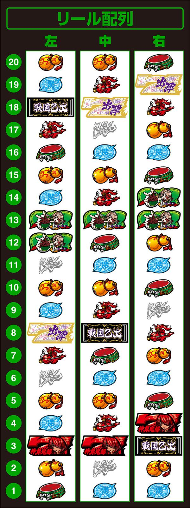

# L戦国乙女4 戦乱に閃く炯眼の軍師 | 設定判別

オリンピアエステートから2023年9月4日導入された戦国乙女4。

2024年6月現在でも非常に人気の機種。
色々な所に出玉トリガーがあり、そこを上手いことやって玉を出す台。
ヒキ強が勝てる機種である。

## リール画像

## ボーナス確率

| 設定 | 初当り  | 機械割 |
| ---- | ------- | ------ |
| 1    | 1/272.7 | 98.2%  |
| 2    | 1/267.3 | 99.0%  |
| 3    | 1/255.3 | 101.2% |
| 4    | 1/238.2 | 105.2% |
| 5    | 1/223.2 | 110.2% |
| 6    | 1/217.1 | 113.0% |

## AT終了画面

| 画面                                   | 示唆         |
| -------------------------------------- | ------------ |
| ヒデヨシ＆カンスケ＆シンゲン＆ノブナガ | 奇数示唆     |
| ヨシモト＆ケンシン＆ウジマサ＆イエヤス | 偶数示唆     |
| モトチカ＆ソウリン＆ドウセツ＆モトナリ | 高設定示唆弱 |
| 可スタンプ                             | 設定2以上    |
| 吉スタンプ                             | 設定3以上    |
| 良スタンプ                             | 設定4以上    |
| 優スタンプ                             | 設定5以上    |
| 極スタンプ                             | 設定6        | 

奇遇示唆の割合は以下の通り。

| 設定  | 奇数示唆 | 偶数示唆 |
| ----- | -------- | -------- |
| 設定1 | 50%      | 50%      |
| 設定2 | 40%      | 60%      |
| 設定3 | 60%      | 40%      |
| 設定4 | 40%      | 60%      |
| 設定5 | 60%      | 40%      |
| 設定6 | 50%      | 50%      |

奇遇示唆はほぼ意味なし。
高設定示唆弱は出れば出るほど良い。
スタンプが出てくれたら話が速い。

## 獲得枚数

| 枚数  | 示唆      |
| ----- | --------  |
| 222枚 | 設定2以上 |
| 333枚 | 設定3以上 |
| 444枚 | 設定4以上 |
| 555枚 | 設定5以上 |
| 666枚 | 設定6以上 |

滅多に出ない。

## オウガイバトル1戦目突破率

| 設定 | 突破率 |
| ---- | ------ |
| 1    | 24.9%  |
| 2    | 25.0%  |
| 3    | 25.5%  |
| 4    | 27.4%  |
| 5    | 30.7%  |
| 6    | 31.7%  |

上記の確率はおそらくレア役を引いた際の突破も含めた確率。

何も引いてないのに突破した場合に設定差があるのかも。

## エピボ

| エピソード | 示唆       |
| ---------- | ---------- |
| カンスケ   | 奇数示唆   |
| ソウリン   | 偶数示唆   |
| ウジマサ   | 高設定示唆 |
| ヒデアキ   | 高設定示唆 |

ウジマサ、ヒデアキのエピソード発生率は以下の通り

| 設定 | 発生率 |
| ---- | ------ |
| 1,2  | 約20%  |
| 3,4  | 約25%  |
| 5,6  | 約33%  |

ヨシテルエピソードは設定示唆要素なし。

## 乙女アタック当選率

| 設定 | 当選率 |
| ---- | ------ |
| 1    | 20.3%  |
| 2    | 20.9%  |
| 3    | 21.8%  |
| 4    | 22.9%  |
| 5    | 23.8%  |
| 6    | 24.4%  |

子役カウンターで、巫女ポイント0到達と乙女アタック当選を数えよう。

## 乙女アタック直撃当選率

| 設定 | チャンス目、強チェリー |
| ---- | ---------------------- |
| 1    | 1.2%                   |
| 2    | 1.3%                   |
| 3    | 1.5%                   |
| 4    | 1.8%                   |
| 5    | 2.1%                   |
| 6    | 2.5%                   |

リールロック2段階の乙女アタック直撃当選率は`50%`で設定差なし。

ここはよく分からない。
チャンス目を引いた時に巫女ポイントが貯まった状態じゃないのに乙女アタックが飛んできたり、
強チェ引いた時に巫女ポイントが貯まって青なのに乙女アタックが飛んできたりしたら、
いいってことなのか？

## 強カワラッシュ直撃確率

| 設定 | 確率      |
| ---- | --------- |
| 1    | 1/10922.7 |
| 2    | 1/9362.3  |
| 3    | 1/8192.0  |
| 4    | 1/6553.6  |
| 5    | 1/5957.8  |
| 6    | 1/5461.3  |

AT終了後、エンディング後、`1/65536`の超強カワループはサンプルから除外しよう。

上記以外で直撃を確認できたら...

## ボーナスゲーム数振り分け

| 設定 | 30G   | 40G   | 50G  |
| ---- | ----- | ----- | ---- |
| 1    | 87.5% | 10.2% | 2.3% |
| 2    | 87.1% | 10.3% | 2.5% |
| 3    | 86.3% | 10.9% | 2.7% |
| 4    | 84.7% | 12.1% | 3.1% |
| 5    | 83.5% | 13.0% | 3.5% |
| 6    | 81.1% | 14.1% | 4.7% |

上記の確率は、強レア役の昇格抽選を除いたものらしい。

何も引いてないのに`40,50G`が選ばれたらワンチャン...

## エンディング、キャラ紹介の1人目

イエヤス、ノブナガ、ウジマサ、ヨシテルが出てくれば高設定に期待。

オウガイ、ムラサメ、コタロウの3人が出てくれば高設定濃厚。

上記のキャラが出てきたらラッキー！

## まとめ

通常時は、巫女ポイント0到達時や強レア役の乙女アタック当選率で設定を推測。

またAT直撃が確認できれば高設定に期待ができる！

戦国乙女ボーナスは、初期ゲーム数で設定を推測。

エピボだった場合、エピソードの種類によって設定を推測。

強カワラッシュは、オウガイバトル突破率、AT終了画面、獲得枚数などで設定を推測。

エンディングはキャラ紹介の1人目に誰が出てくるかで設定を推測。

## 公式サイト

https://www.heiwanet.co.jp/products/pachislot/l-sg5/

## 機種解析サイト、リール画像

https://p-town.dmm.com/machines/4395
