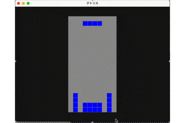

# Bevyでテトリスを作る

この記事では、Bevyを使ったテトリスの作り方について説明しています。

テトリスとは、7種類のテトリミノがフィールド上部からランダムに1種類ずつ落下してきて、
うまいこと`10x20`のフィールドの横のラインを揃えるとブロックが消えてポイントが加算される。

これを繰り返して高いスコアを目指す落ちものパズルゲームです。

今回実装したテトリスは以下のようなものです。



ここでのテトリスでは、本当に最低限の機能を持つゲームとなっています。
なのでゲーム性などを持たせようとするなら追加の機能が必要となるでしょう。

## ソースコード

ゲーム制作に使用したソースコードは以下のURLから入手することができます。

https://github.com/ittokunvim/bevy-tetris


## バージョン

ゲーム制作に使用した｀`Bevy`のバージョンは以下の通りです。
以下のバージョン以外だと動作しない可能性が高いのでご注意ください。

```toml
bevy = "0.15.1"
```

## Cargoを追加

ではここからゲーム制作を開始していきます。

まずは作業を行うディレクトリを作成します。
次に`Bevy`を使用するために`Cargo`というパッケージマネージャを追加します。
ここで動作を確認しておきます。`Hello, World!`がコンソールに表示されたら成功です。

```sh
# ディレクトリを作成
mkdir ittoku-tetris
# Cargoを追加
cargo init
# 動作を確認
cargo run
```

## アセットをダウンロード

次に今回使用するアセットをあらかじめ用意しておきます。

以下のURLに飛んで、下の方の`assets.zip`をクリックしてダウンロードを行います。

ダウンロードが終わったら、ファイルを開いて解凍し、作成したプロジェクト内に移動します。

https://github.com/ittokunvim/bevy-tetris/releases/tag/v0.1.0

## Bevyを追加

次に`Cargo`に`Bevy`を追加します。

`Bevy`を追加するために以下のコマンドを実行します。

```sh
cargo add bevy@0.15.1
```

次に`src/main.rs`に`Bevy`のセットアップコードを追加します。

ここでは、タイトル、画面サイズ、背景色、アセットのパス、カメラなどが設定されています。

```rust
use bevy::prelude::*;

const GAMETITLE: &str = "テトリス";
const WINDOW_SIZE: Vec2 = Vec2::new(640.0, 480.0);
const BACKGROUND_COLOR: Color = Color::srgb(0.1, 0.1, 0.1);
const PATH_FONT: &str = "fonts/misaki_gothic.ttf";
const PATH_IMAGE_RETRY: &str = "images/retry.png";
const PATH_SOUND_BGM: &str = "bevy-tetris/bgm.ogg";

const GRID_SIZE: f32 = 20.0;

fn main() {
    App::new()
        .add_plugins(DefaultPlugins
            .set(WindowPlugin {
                primary_window: Some(Window {
                    resolution: WINDOW_SIZE.into(),
                    title: GAMETITLE.to_string(),
                    ..Default::default()
                }),
                ..Default::default()
            })
        )
        .insert_resource(ClearColor(BACKGROUND_COLOR))
        .insert_resource(Time::<Fixed>::from_seconds(1.0 / 60.0))
        .add_systems(Startup, setup)
        .run();
}

fn setup(
    mut commands: Commands,
    asset_server: Res<AssetServer>,
) {
    // camera
    commands.spawn(Camera2d::default());
    // bgm
    let sound = AudioPlayer::new(asset_server.load(PATH_SOUND_BGM));
    let settings = PlaybackSettings::LOOP;
    commands.spawn((sound, settings));
}
```

では以下のコマンドを実行して動作を確認してみましょう。
画面が現れて、音楽も流れたら成功です。

```sh
cargo run
```

## フィールドを生成


## キー、イベントを設定


## ブロックのデータを設定


## ブロックを実装


### 生成処理を実装


### 移動処理を実装


### 回転処理を実装


### 削除処理を実装


### ゲームオーバー処理を実装


## ゲームオーバーを実装


